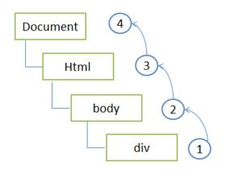
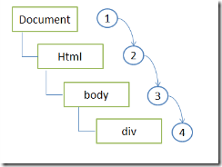

# 事件


## 事件冒泡

事件冒泡 : 当一个元素接收到事件的时候，会把他接收到的所有传播给他的父级，一直到顶层window.事件冒泡机制

```html
<style>
div {padding: 40px;}
#div1 {background:red}
#div2 {background:green}
#div3 {background:blue}
</style>

<div id="div1">
    <div id="div2">
        <div id="div3"></div>
    </div>
</div>

<script>
var oDiv1 = document.getElementById('div1');
var oDiv2 = document.getElementById('div2');
var oDiv3 = document.getElementById('div3');
function fn1() {
    alert( this.id );
}
oDiv1.onclick = fn1;
oDiv2.onclick = fn1;
oDiv3.onclick = fn1;
</script>
```

点击div3,  div3 div2 div1上的点击事件都会被触发

事件冒泡与样式无关,与html结构相关


示意图:





## 事件对象

在触发DOM上的某个事件的时候会产生一个事件对象event，这个对象包含着所有与事件有关的信息，包括产生事件的元素、事件类型等相关信息。所有浏览器都支持event对象，但支持方式不同。

事件对象必须在一个事件调用的函数里面使用才有内容
事件函数：事件调用的函数，一个函数是不是事件函数，不在定义的决定，而是取决于这个调用的时候

### 兼容

ie/chrome : event是一个内置全局对象
标准下 : 事件对象是通过事件函数的第一个参数传入

如果一个函数是被事件调用的那么，这个函数定义的第一个参数就是事件对象


ie/chrome下

```js
function fn(){
    alert(event);
}

document.onclick = fn;
```

标准下:

```js
function fn(ev){
    alert(ev);
}
document.onclick = fn;
```

兼容性写法:

```js
function fn(ev){
    var ev = ev || window.enent;
    alert(ev);
}
document.onclick = fn;
```

### clientX clientY

clientX 事件属性返回当事件被触发时鼠标指针向对于浏览器页面（或客户区）的水平坐标。
clientY 事件属性返回当事件被触发时鼠标指针向对于浏览器页面（或客户区）的垂直坐标。

例如，当你点击客户端区域的左上角时，鼠标事件的 clientX 值为 0 ，这一值与页面是否有水平滚动无关。

```js
document.onclick = function(e){
    var e = e||window.event;
    alert(e.clientX +' '+e.clientY);
}
```

示例: 方块跟着鼠标移动


### 取消冒泡

标准下:

event.stopPropagation()

ie下:

e.cancelBubble = true;


兼容性写法:

```js
function stopPropagation(e) {
    if (e.stopPropagation)
        e.stopPropagation();
    else
        e.cancelBubble = true;
}
```

### 阻止默认行为

标准下:
event.preventDefault();

ie下:
event.returnValue = false;

兼容性写法:

```js
function preventDefault(e) {
    if (e.preventDefault)
        e.preventDefault();
    else
        e.returnValue = false;
}
```


### target

Element 只读  触发事件的目标元素

```js
function getTarget(e) {
    return e.target || e.srcElement;//ie下为srcElement;
}
```


## 给dom对象绑定事件处理函数

### 方法一

```js
function fn(){
    alert(1);
}
div.onclick = fn;
```

缺点:  只能绑定一个处理函数

```js
function fn1(){
    alert(1);
}

function fn2(){
    alert(1);
}

div.onclick = fn1;
div.onclick = fn2;
```

div.onclick 属性中的值会被覆盖


### 方法二


标准：obj.addEventListener(事件名称，事件函数，是否捕获);
    1.有捕获  (通过是否捕获参数指定, 默认为false
    如果为false表示在冒泡阶段触发,
    为true表示在捕获阶段触发)
    2.事件名称没有on
    3.事件执行的顺序是正序
    4.this触发该事件的对象

ie：obj.attachEvent(事件名称，事件函数);
    1.没有捕获
    2.事件名称有on
    3.事件函数执行的顺序：标准ie-》正序   非标准ie-》倒序
    4.this指向window

标准ie指定的是ie9以上（包括ie9）

####　基本用法

标准下:

```js
function fn1(){
    alert(1);
}

function fn2(){
    alert(2);
}

oDiv.addEventListener('click', fn1, false);
oDiv.addEventListener('click', fn2, false);
```

ie下:

```js
function fn1(){
    alert(1);
}

function fn2(){
    alert(2);
}

oDiv.attachEvent('onclick', fn1);
oDiv.attachEvent('onclick', fn2);
```


#### 事件执行的顺序

```js
function fn1(){
    alert(1);
}

function fn2(){
    alert(2);
}

oDiv.addEventListener('click', fn1, false);
oDiv.addEventListener('click', fn2, false);
```

标准下, 点击之后先执行fn1 再执行fn2

```js
function fn1(){
    alert(1);
}

function fn2(){
    alert(2);
}

oDiv.attachEvent('onclick', fn1);
oDiv.attachEvent('onclick', fn2);
```

ie8, ie7中先执行fn2


#### 事件触发事件函数中this的指向

标准下：

```js
function fn1(){
    console.log(this);
}

oDiv.addEventListener('click', fn1, false);
```

this触发该事件的对象


ie下：
```js
function fn1(){
    alert(this.navigator.userAgent);
}

oDiv.attachEvent('onclick', fn1);
```

this指向的是window

针对这个问题我们可以使用函数的call方法,　 可以改变this的指向


```js
function fn(){
    console.log(this);
}

var obj = {
    name: 'xxx'
}

fn.call(obj);
```


解决ie中事件触发事件函数中this的指向问题

```js
obj.attachEvent('onclick', function() {
    fn.call(obj);
});
```


### 兼容性写法

```js
function bindEvent(obj, evname, fn) {
    if (obj.addEventListener) {
        obj.addEventListener(evname, fn, false);
    } else {
        obj.attachEvent('on' + evname, function() {
            fn.call(obj);
        });
    }
}
```


## 事件的捕获



事件流包括三个阶段，事件捕获阶段，处于目标阶段，事件冒泡阶段，首先发生的是事件捕获，为截取事件提供机会，然后是实际目标接收事件，最后是冒泡阶段


```html
<style>

div {padding: 50px;}
#div1 {background: red;}
#div2 {background: blue;}
#div3 {background: green;}

</style>

<div id="div1">
    <div id="div2">
        <div id="div3"></div>
    </div>
</div>

<script>
var oDiv1 = document.getElementById('div1');
var oDiv2 = document.getElementById('div2');
var oDiv3 = document.getElementById('div3');

function fn1() {
    alert( this.id );
}

oDiv1.addEventListener('click', fn1, true);
oDiv2.addEventListener('click', fn1, true);
oDiv3.addEventListener('click', fn1, true);
</script>
```


## 移除事件

ie : obj.detachEvent(事件名称，事件函数);
标准 : obj.removeEventListener(事件名称，事件函数，是否捕获);


```js
function fn1() {
    alert(1);
}
function fn2() {
    alert(2);
}


document.addEventListener('click', fn1, false);
document.addEventListener('click', fn1, true);
document.addEventListener('click', fn2, false);

document.removeEventListener('click', fn1, false);
```

## 键盘事件

onkeydown : 当键盘按键按下的时候触发
onkeyup : 当键盘按键抬起的时候触发


```js
document.onkeydown = function(ev) {

    var ev = ev || event;
    alert(ev.keyCode);
    
}
```

### 与键盘事件相关的事件对象的属性值

- event.keyCode : 数字类型 键盘按键的值 键值
- event.ctrlKey, event.shiftKey, event.altKey

这三个键　我们通常称为功能键

当一个事件发生的时候，如果ctrl || shift || alt 是按下的状态，相应的属性值返回true，否则返回false

```js
document.onclick = function(ev) {
    var ev = ev || event;
    
    alert(ev.ctrlKey);
}
```

当我们点击时，如果是按住`ctrl`键则弹出true;

示例：　留言板

当输入完成，　并且按住`ctrl`+`enter(回车)`,添加留言


```html
<input type="text" id="text1" />
<ul id="ul1"></ul>
```

```js
var oText = document.getElementById('text1');
var oUl = document.getElementById('ul1');

oText.onkeyup = function(ev) {
    
    var ev = ev || event;
    
    //alert(this.value);
    if ( this.value != '' ) {
        
        //不能写成ev.keyCode == 13 && ev.keyCode == 17;
        //应为ev.keyCode不可能同时为13 和17
        if (ev.keyCode == 13 && ev.ctrlKey) {
        
            var oLi = document.createElement('li');
            oLi.innerHTML = this.value;
            
            if ( oUl.children[0] ) {
                oUl.insertBefore( oLi, oUl.children[0] );
            } else {
                oUl.appendChild( oLi );
            }
            
        }
        
    }
    
}
```


不是所有元素都能够接收键盘事件，能够响应用户输入的元素，能够接收焦点的元素就能够接收键盘事件
    
onkeydown : 如果按下不抬起，那么会连续触发

示例：　移动div


## oncontextmenu 

右键菜单事件，当右键菜单（环境菜单）显示出来的时候触发

```js
document.oncontextmenu = function(){
    alert(1);
    return false;//阻止默认行为
}
```


例子　弹出自定义右键菜单

```js
var oDiv = document.getElementById('div1');
    
document.oncontextmenu = function(ev) {
    var ev = ev || event;
    
    oDiv.style.display = 'block';
    
    oDiv.style.left = ev.clientX + 'px';
    oDiv.style.top = ev.clientY + 'px';
    
    return false;
    
}

document.onclick = function() {
    oDiv.style.display = 'none';
}
```

