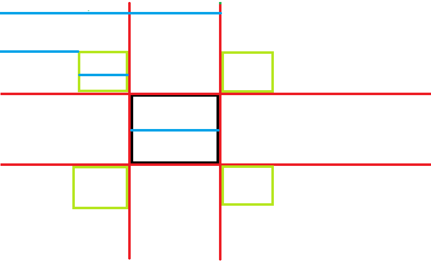

#　事件应用

## 拖拽

### 拖拽原理

#####　三大事件
    +　onmousedown : 选择元素
    +　onmousemove : 移动元素
    +　onmouseup   : 释放元素


```html
<style>
div{
    height: 100px;
    width: 100px;
    background: yellowgreen;
    position: absolute;
}
</style>
<div id="div1"></div>
```

```js
var oDiv = document.getElementById('div1');

oDiv.onmousedown = function(){
    oDiv.onmousemove = function(){//鼠标移动事件是在鼠标按下事件之后

    }

    oDiv.onmouseup = function (){//鼠标抬起之后要清除鼠标按下事件
        oDiv.onmousemove= null;
        oDiv.onmouseup = null;
    }
}
```

-　鼠标和Div的相对距离不变

```js
var oDiv = document.getElementById('div1');

oDiv.onmousedown = function(ev){
    var ev = ev || window.event;

    //鼠标和Div的相对距离 
    var disX = ev.clientX - oDiv.offsetLeft;
    var disY = ev.clientY - oDiv.offsetTop;

    oDiv.onmousemove = function(ev){
        var ev = ev || window.event;
        oDiv.style.left = ev.clientX - disX + 'px';
        oDiv.style.top = ev.clientY - disY + 'px';
    }

    oDiv.onmouseup = function (){
        oDiv.onmousemove= null;
        oDiv.onmouseup = null;
    }
}
```

#####　把拖拽加到document上

如果拖得太快，　会移出div, 可以把onmousemove事件加在document上

注意：移出事件也是在doucment

```js
var oDiv = document.getElementById('div1');

oDiv.onmousedown = function(ev){
    var ev = ev || window.event;
    var disX = ev.clientX - oDiv.offsetLeft;
    var disY = ev.clientY - oDiv.offsetTop;
    document.onmousemove = function(ev){
        var ev = ev || window.event;
        oDiv.style.left = ev.clientX - disX + 'px';
        oDiv.style.top = ev.clientY - disY + 'px';
    }

    oDiv.onmouseup = function (){
        document.onmousemove= null;
        oDiv.onmouseup = null;
    }
}
```

##### 拖拽的问题

如果拖拽文字或者图片, 由于浏览器的默认行为, 不能正常的拖拽

解决办法： 阻止浏览器默认行为

```html
<!DOCTYPE html>
<html lang="en">
<head>
    <meta charset="UTF-8">
    <title>Document</title>
<style>
img{;
    position: absolute;
}
</style>
</head>
<body>
    
<script>
var oImg = document.getElementsByTagName('img')[0];


oImg.style.position = 'absolute';
oImg.onmousedown = function(ev){
    var ev = ev || window.event;
    var disX = ev.clientX - oImg.offsetLeft;
    var disY = ev.clientY - oImg.offsetTop;
    document.onmousemove = function(ev){
        var ev = ev || window.event;
        oImg.style.left = ev.clientX - disX + 'px';
        oImg.style.top = ev.clientY - disY + 'px';
        return false;//阻止浏览器默认行为

    }

    oImg.onmouseup = function (){
        document.onmousemove= null;
        oImg.onmouseup = null;
    }
    return false;//阻止浏览器默认行为
}
</script>
</body>
</html>
```

### 拖拽的封装

两个步骤：

1. 将拖拽代码全部放进drag函数中
2. 把需要变化的变量改成参数

```js
function drag(obj){
    obj.onmousedown = function(ev){
        var ev = ev || window.event;
        var disX = ev.clientX - obj.offsetLeft;
        var disY = ev.clientY - obj.offsetTop;
        document.onmousemove = function(ev){
            var ev = ev || window.event;
            obj.style.left = ev.clientX - disX + 'px';
            obj.style.top = ev.clientY - disY + 'px';
            return false;

        }

        obj.onmouseup = function (){
            document.onmousemove= null;
            obj.onmouseup = null;
        }
        return false;
    }

}
```


##### 限制拖拽的范围

在窗口内拖动

```js
function drag(obj){
    obj.onmousedown = function(ev){
        var ev = ev || window.event;


        var disX = ev.clientX - obj.offsetLeft;
        var disY = ev.clientY - obj.offsetTop;
        document.onmousemove = function(ev){
            var ev = ev || window.event;


            var left  = ev.clientX - disX;
            var top = ev.clientY - disY;
            if(left<0){
                left=0;
            }
            else if(left>document.documentElement.clientWidth-obj.offsetWidth){
                left = document.documentElement.clientWidth-obj.offsetWidth;
            }
            if(top<0){
                top=0;
            }
            else if(top>document.documentElement.clientHeight-obj.offsetHeight){
                top = document.documentElement.clientHeight-obj.offsetHeight;
            }

            obj.style.left =  left + 'px';
            obj.style.top = top + 'px';
            return false;

        }

        obj.onmouseup = function (){
            document.onmousemove= null;
            obj.onmouseup = null;
        }
        return false;
    }

}
```


##### 磁性吸附效果

比如说以前的一些音乐播放器, 播放列表和歌词是两个分开的面板, 可以分开可以合并
合并的时候不需要精确的拖拽，而是拖拽到两个面板距离很近时自动合并 


```js
function drag(obj){
    obj.onmousedown = function(ev){
        var ev = ev || window.event;


        var disX = ev.clientX - obj.offsetLeft;
        var disY = ev.clientY - obj.offsetTop;
        document.onmousemove = function(ev){
            var ev = ev || window.event;


            var left  = ev.clientX - disX;
            var top = ev.clientY - disY;
            if(left<100){//距离可视区域范围的四边小于50px，则元素将直接吸附对应的边上
                left=0;
            }
            else if(left>document.documentElement.clientWidth-obj.offsetWidth){
                left = document.documentElement.clientWidth-obj.offsetWidth;
            }
            if(top<0){
                top=0;
            }
            else if(top>document.documentElement.clientHeight-obj.offsetHeight){
                top = document.documentElement.clientHeight-obj.offsetHeight;
            }

            obj.style.left =  left + 'px';
            obj.style.top = top + 'px';
            return false;

        }

        obj.onmouseup = function (){
            document.onmousemove= null;
            obj.onmouseup = null;
        }
        return false;
    }

}
```

### 碰撞检测

js中我们使用的是判断两个物体位置是否重合来判断两个物体是否发生了碰撞

常用的方法是使用九宫格法




拖动div, 如果检测到碰撞, 则改变图片


```html
<!DOCTYPE html>
<html lang="en">
<head>
    <meta charset="UTF-8">
    <title>Document</title>
<style>
div{
    height: 100px;
    width: 100px;
    background: yellowgreen;
    position: absolute;

}

img{
    position: absolute;
    top: 300px;
    left: 500px;
}


</style>
</head>
<body>
    <div id="div1"></div>
    
<script>
function preventDefault(e) {
    if (e.preventDefault)
        e.preventDefault();
    else
        e.returnValue = false;
}

function addEvent(node, type, handler) {
    if (!node) return false;
    if (node.addEventListener) {
        node.addEventListener(type, handler, false);
        return true;
    }
    else if (node.attachEvent) {
        node['e' + type + handler] = handler;
        node[type + handler] = function() {
            node['e' + type + handler](window.event);
        };
        node.attachEvent('on' + type, node[type + handler]);
        return true;
    }
    return false;
}


function removeEvent(node, type, handler) {
    if (!node) return false;
    if (node.removeEventListener) {
        node.removeEventListener(type, handler, false);
        return true;
    }
    else if (node.detachEvent) {
        node.detachEvent('on' + type, node[type + handler]);
        node[type + handler] = null;
    }
    return false;
}

function drag(obj){


    addEvent(obj, 'mousedown', function(ev){
        function onMousemove(ev){
            var ev = ev || window.event;
            obj.style.left = ev.clientX - disX + 'px';
            obj.style.top = ev.clientY - disY + 'px';
            preventDefault(ev);
            
        }

        function onMouseup(ev){
            removeEvent(document, 'mousemove', onMousemove);
            removeEvent(document, 'mouseup', onMouseup);
        }


        var ev = ev || window.event;
        var disX = ev.clientX - obj.offsetLeft;
        var disY = ev.clientY - obj.offsetTop;
        addEvent(document, 'mousemove', onMousemove);
        addEvent(document, 'mouseup', onMouseup);

        preventDefault(ev);

        
    })

}


var oDiv = document.getElementById('div1');
var oImg = document.getElementsByTagName('img')[0];

drag(oDiv);

addEvent(oDiv, 'mousemove', function(ev){
    var ev = ev || window.event;
    
    var oDrag = this;
    var oDragL = oDrag.offsetLeft;
    var oDragT = oDrag.offsetTop;
    var oDragW = oDrag.offsetWidth;
    var oDragH = oDrag.offsetHeight;

    var oTarget = oImg;
    var oTargetL = oTarget.offsetLeft;
    var oTargetT = oTarget.offsetTop;
    var oTargetW = oTarget.offsetWidth;
    var oTargetH = oTarget.offsetHeight;


    if( oDragL > oTargetL - oDragW  && 
        oDragL < oTargetL+ oTargetW &&
        oDragT > oTargetT - oDragH  &&
        oDragT < oTargetT + oTargetH
    ){//碰撞
        oTarget.src = 'img/2.jpg';

    }
    else{
        oTarget.src = 'img/1.jpg';
    }
})

</script>
</body>
</html>
```


