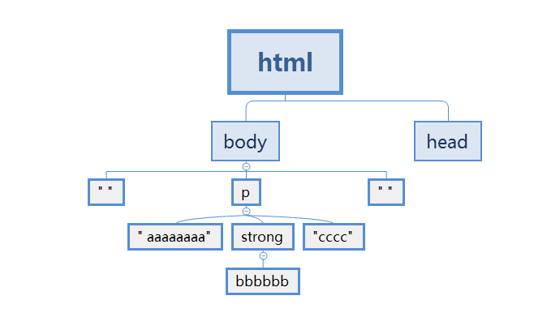
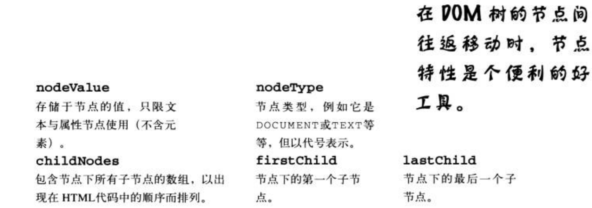

# dom

## 访问HTML元素

getElementById

getElementsByTagName

## 与内在的HTML建立接触

我们可以访问到HTML元素，真正的重点在于元素里存储的内容。

我们可以透过innerHTML属性, 访问元素包含的文本内容。

### innerHTML也能用于设置网页内容

只要把文本字符串指派给元素的innerHTML属性，元素内容即可设为HTML文本字符串。新内容将取代任何原本属于元素的内容。


## 见树叶见林: Document Object Model(DOM)


我们的网页看起来就像形成树状的层层元素。 书上的每片叶子就是个节点(node),
直接关联到网页上的各个元素。 当树上的某节点出现在另一个节点下时， 则被称为子节点(child)。

```html
<html>
    <head></head>

    <body>
        <p>
            aaaaaaaa <strong>bbbbbb</strong>cccc
        </p>
    </body>
</html>
```



## 你的网页是DOM节点的集合

DOM树的每个节点均根据类型(type)分类. 主要的节点类型对应至网页的结构，主要以元素节点(element node) 和文本节点(text node) 构成。

主要节点类型:

1. DOCUMENT   位于DOM树最顶端的节点，代表文档本身，且出现在HMTL元的的上一层
2. ELEMENT  对应到HTML标签的HTML元素
3. TEXT 元素的文本内容
4. ATTRIBUTE 元素的属性，可透过节点访问，但不会直接出现在DOM树里

把节点类型应用到网页的DOM树上，有助于理清DOM, 理解网页各部分的方式

练习:

画出下面html结构的dom树

```html
<html>
 <head> 
  <meta charset="utf-8" /> 
  <meta name="viewport" content="width=device-width" /> 
  <title>JavaScript</title> 
  <link rel="stylesheet" href="/css/foundation.css" /> 
  <link rel="stylesheet" href="/css/main.css" /> 
  <script async="" src="//www.google-analytics.com/analytics.js"></script>
 </head> 
 <body> 
  <header class="top-bar" id="header"> 
   <div class="fixed"> 
    <nav class="top-bar"> 
     <ul> 
      <li class="name has-dropdown"> <h1><a href="/">JavaScript </a></h1> 
       <ul class="dropdown"> 
        <li><a href="/#introduction">导论</a></li> 
        <li><a href="/#grammar">语法</a></li> 
       </ul> </li> 
     </ul> 
     <section> 
      <ul class="left"> 
       <li class="divider"></li> 
       <li class="has-dropdown"><a class="active" href="#"> 浏览器环境 </a>
        <ul class="dropdown"> 
         <li><a href="/bom/ajax.html">AJAX</a></li>
        </ul></li>
      </ul>
     </section>
    </nav>
   </div>
  </header>
 </body>
</html>
```

## 利用属性攀爬DOM树

大部分与DOM的交互均从document对象开始，它是文档节点数的最上层节点。

文档对象提供各种好用方法(method)，例如getElemenetById、getElementsByTagName，

以及许多属性， document对象的许多方法和属性 树上的每个节点都有，有些属性甚至能帮我们找到其他节点。 




练习： 找出下面代码代表的值

```js
document.getElementsByTagName("body")[0].childNodes[1].lastChild;
```

```html
<body>
    <div>
        <input type="text">
    </div>
</body>
```


