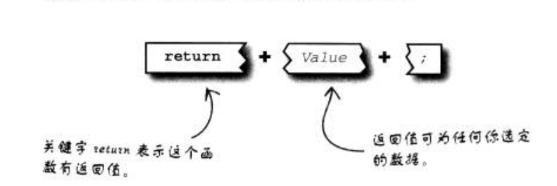

# 函数


简化，重复利用，回收再利用

## 函数的定义（创建函数）


大括号围起的函数主体--其实就是复合语句。

函数可以理解为--命令：

比如我们使用洗衣机，洗衣的开关就相当于函数； 我们只需要按下开关，洗衣机就开始工作；

我们并不需要关心它内部的原理（相当于函数主体）；


getElementById就是一个函数； 当我调用它的时候，它就会把我们找到对应id的html元素

至于它内部是怎么找的 我们并不关心；

我们也可以把函数看成一个黑盒子；信息可以流入流出；但盒子内的事情都由盒子负责，

因此盒子外的代码完全没有相关；


## 函数的调用


注意：  上面只是定义了（创建了）函数；函数主体代码并不会运行； 就好像你按洗衣机开关，洗衣机绝对不会启动；

如何调用函数：

```js
function start(){
    alert('开启洗衣');
}

start(); //函数名加上括号就是调用函数的意思
```


## 传递信息给函数

有时候我们需要传入信息给函数； 从而让函数更加的灵活；

比如说我们有一个打招呼的函数sayHi，虽然这个函数没有什么用；

```js
function sayHi(){
    alert('张三， 你好！');
}
```

现在这个函数只能跟张三打招呼；我们现在要求可以跟不同的人打招呼；那我们就需要传递写信息给函数；我们总应该知道要跟谁打招呼吧；

```js
function sayHi(who){
    alert(who+'你好！')；
}

sayHi('张三');
sayHi('李四');
```

### 传参

给函数传递信息，我们称为传参

数据通过函数的自变量（argument）传入函数；

再度查看创建函数的语法； 自变量放在小括号的中间；


1. 函数的自变量的可以有多个，用逗号分隔开，个数没有限制，但最好维持在3个以下比较合理；
2. 你可以用字面量传递任何数据给函数； 变量或字面量('张三')；


### 函数自变量作为数据

当数据作为自变量而被传入函数，它的行为就像函数内已初始化的局部变量；

```js
sayHi('张三');
```

相当于

```js
function sayHi(){
    var who = '张三';
    alert(who+'你好！')；
}
sayHi();
```

## 函数去除重复代码

考虑下面三段代码：

```js
//下午票价优惠10%
var matineeTicket = adulteTicket * (1 - 0.10);
```

```js
//老年票价优惠15%
var seniorTicket = adulteTicket * (1 - 0.15);
```

```js
//下午票价优惠20%
var childTicket = adulteTicket * (1 - 0.20);
```

上述各项任务分别计算了三张电影票的折扣价。 但这些任务能统一为一项任务---根据折扣比例计算电影票价。

```js
var adultTickt = 10;
function discountPrice(price, percetage){
    return (price * (1 - (precentage/100) ));
}

var matineeTicket = discuntPrice(adultTickt, 10);
var seniorTicket = discuntPrice(adultTickt, 10);
var childTicket = discuntPrice(adultTickt, 10);
```

这段代码看上去也没有精简很多的代码； 但是考虑一下如果计算规则比较复杂；


## 从函数返回数据

从函数返回数据很重要；比如说上面计算票价的函数；它的作用是为了得到计算的结果；
如果没有返回值； 计算就失去了意义；

从函数返回信息牵涉到关键字return的使用，关键字后接欲返回的信息。然后这些数据即被返回给调用函数的代码；




return语句能放在函数的任何地方，只要记得，函数遇到return后将立刻结束；
不在运行return语句之后的代码；

所以，return 不只是返回数据，同时也负责结束函数。

```js
function sayHi(){
    return;
    alert('你好！');
}
sayHi();
```
alert('你好！'); 永远也不会执行；

因为return语句立即结束函数执行；我们可用它控制函数流程

```js
function sum(a, b){
    if(a<0 || b< 0){
        return;//如果a和b有一个小于0 则退出函数
    }

    return a+b;
}
```


## 函数只是数据

函数只不过是变量；  我们可以把函数主体看成值，函数名则为变量名；

下面是我们熟悉的创建函数的方式：


另一种创建函数的方式：


这段代码显示了函数也能利用变量语法而建立，甚至构成元件也相同：

独一无二的标识符（函数名称）、值（函数主体）。 当函数主体单独出现而没有名字时，我们称为函数字面量。

所以函数也可以像变量一样操作，比如把它的值赋给另一个变量


## 调用或引用你的函数

指派函数名称给另一个变量时，就是让变量访问函数主体。换句话说，你可以用下列方式：


调用myShowSeatStatus()函数的结果与调用showSeatStatus相同，因为两个函数最后都引用了相同的代码。

因此，函数名称也被称为函数引用；


‘引用函数’与‘调用函数’的差别，与函数名称后是否附有括号()有关。 函数引用只会单独出现，但函数调用则必定后随括号，很多时候还附有自变量


练习： 写出alert最后的结果

```js
function doThis(num){
    num++;
    return num;
}

function doThat(num){
    num--;
    return num;
}

var x = doThis(11);
var y = doThat;
var z = doThat(x);

x = y(z);
y = x;

alert(doThat(z-y));
```

## 回调函数

既然函数也是变量，那我们可以不以通过自变量将函数当成数据传递给另一个函数？

当然是可以的

```js
function foo(cb){
    cb();
}

function callBack(){
    alert('我是回调函数');
}
```

通过这种方式调用的函数； 我们成为回调函数


## 事件和回调函数

一直以来，我们都在利用回调函数，回调函数最常用于处理事件。 浏览器会调用它们（不是由你的程序代码直接调用）；


```js
div.onclick = function(){
    ....
}
```


