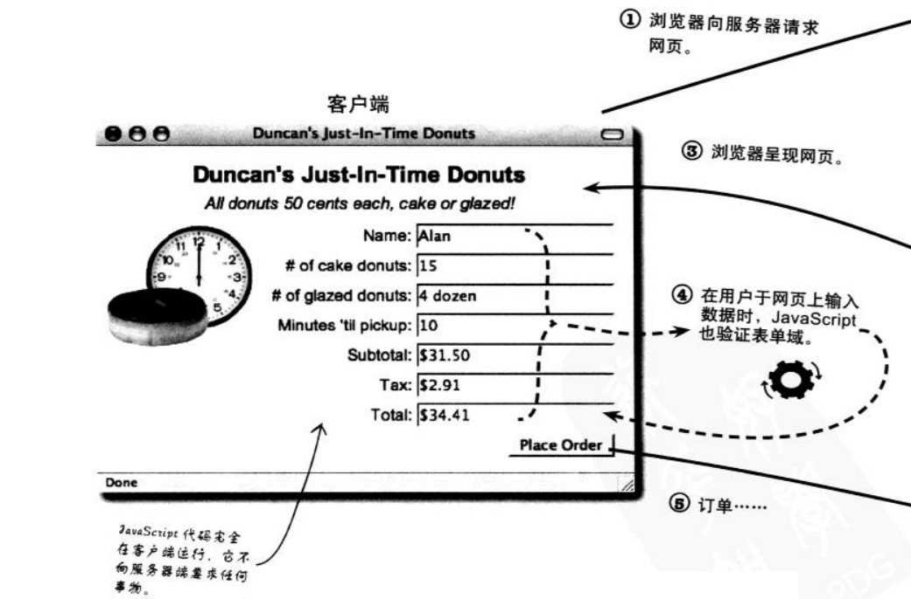
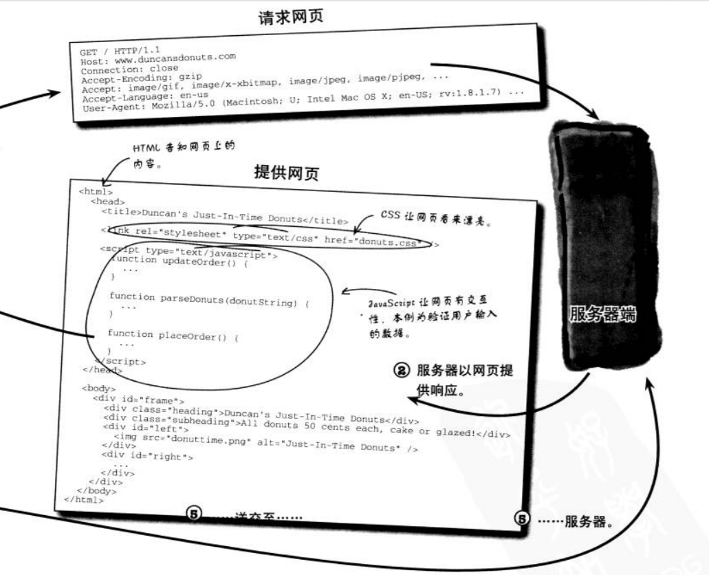
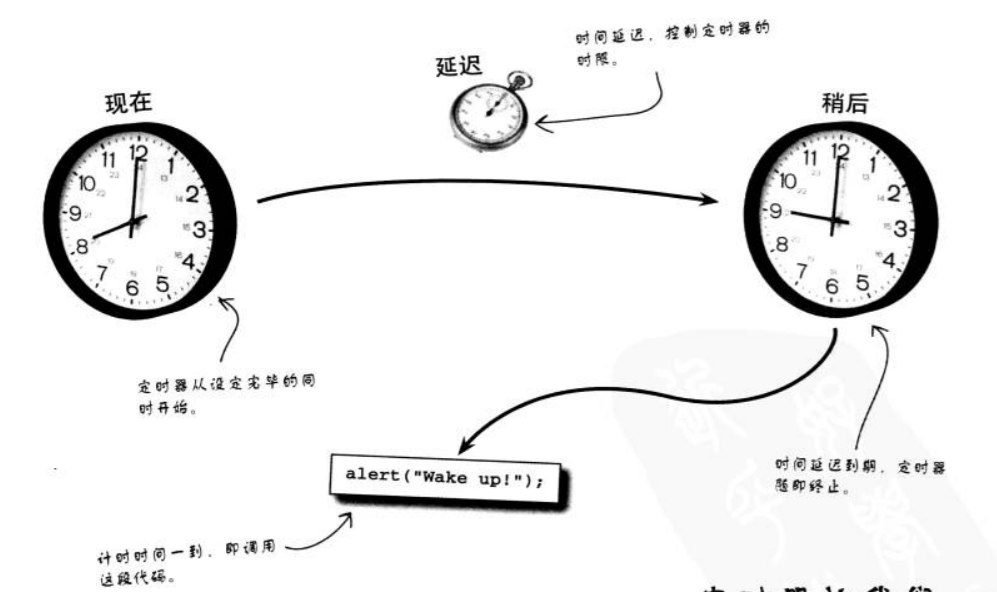

# 客户端

浏览器探索

客户即用户的意思，客户端即客户使用的工具（这里就是直到浏览器了）

## 客户端、服务器端、Javascript

当你点击超链接或在浏览器里输入一段URL(比如说http://www.baidu.com)，浏览器都会向某个网站服务器请求网页。获取的网页中会包含js代码，负责与浏览器合作响应用户的交互，浏览器里运行js代码的部分称为javascript解释器。




一旦网页传送到浏览器后，服务器大致就已退场了。事实上，网页传送完毕后，
js的每项行为均限制在浏览器中。这一点使得网页负有更多责任，因为网页不用等待服务器处理和返回数据。 这种处理就是js被称为客户端语言的原因。



## 浏览器能为你做什么

浏览器负责执行js代码，js因此可以访问浏览器的一些信息和功能:

比如说：

1. 获取浏览器窗口的宽高
2. 浏览器历史记录
3. 调用浏览器定时
。。。。


## 定时器

js中能设定定时器(timer). js定时器的工作方式很想闹钟：先设定闹钟醒来的时间；
设定时间来临，即触发某段代码。　

但是，跟闹钟不一样的是，定时器不是设置的时间点， 而是距当前时间的一段延时时间段




## 创建定时器

有两个关键:

1. 延时的时间
2. 让定时器知道时限来临时该运行的程序代码。 

从你设定完成的那一刻起，定时器马上开始走动。

时间单位： 毫秒  (1000毫秒==1秒)


```js
setTimeout(function(){
    alert('定时器时间到了！');
}, 1000);
```


## 每个程序都有大限

我的js代码都是有生命周期的(life cycle);

就是从网页载入开始，一直到我们关闭网页；

生命周期将影响存储在脚本的变量里的数据。

在程序的生命周期结束时，会摧毁所有变量。再次打开网页，一切都会重新来过

```js
var i=0;
document.onclick = function(){
    i++;
    alert(i);
}
```

每点击一次，alert的值都会加1，但是如果关闭网页重新打开，又是从1开始；


## cookie延长脚本的生命周期

面对上面的问题， 如果我们希望，如果我们关闭了网页再次打开，alert的值依然延续关闭前的状态；


我们需要知道一个新的概念: `持久化存储`，有时候，我们真的需要不会消失的数据。
但js变量的生命却如昙花一现，于浏览器关闭或网页更新时就消失。

浏览器的cookie提供了持久地存储数据， 让数据比程序生命周期更长的方式.


cookie, 是浏览器存储在用户计算里的一块数据。 cookie很类似于js变量，只不过在你关闭浏览器，重新载入网页，关掉计算机的电源，cookie依然在你计算机里。

也可以把cookie看你电脑里的文件； 只要不删除，一直都在


### cookie记录名称与数据值....但也会过期

cookie以独一无二的名称存储一段数据，这点很像变量。

但是，cookie可以设定有效日期(expiration date),时刻一到，
则销毁cookie, 这点跟变量不一样。

实际上，cookie并非真的永恒不变，它们只是比变量的寿命更长。


cookie.js

```js
function writeCookie(name, value, days){
    var expries = '';
    if(days){
        var date = new Date();
        date.setTime(date.getTime() +  (days * 24 * 60 * 60 * 1000) );
        expires = ';expires='+ date.toGMTString();
    }

    document.cookie = name + '=' + value + expires + ';path=/';
}

function readCookie(name){
    var searchName = name+'=';
    var cookies = document.cookie.split(';');
    for(var i=0;i<cookies.length;i++){
        var c= cookies[i];
        while(c.charAt(0) == ' '){
            c = c.substring(1, c.length);
        }

        if(c.indexOf(searchName) == 0){
            return c.substring(searchName.length, c.length);
        }
    }
    return null;
}
```

```js
var i = readCookie('i') || 0;
document.onclick = function(){
    i++;
    writeCookie('i', i, 1);
    alert(i);
}
```

由于同源策略，使用firefox测试


## cookie影响浏览器的安全性

不要把敏感的信息存储在cookie，比如说密码

cookie会被传给服务器，在传输的过程，有被截取的风险


