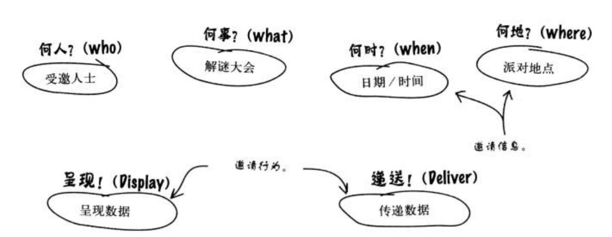
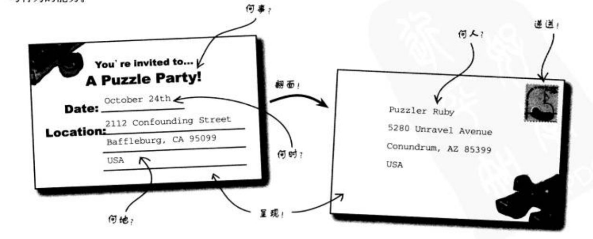
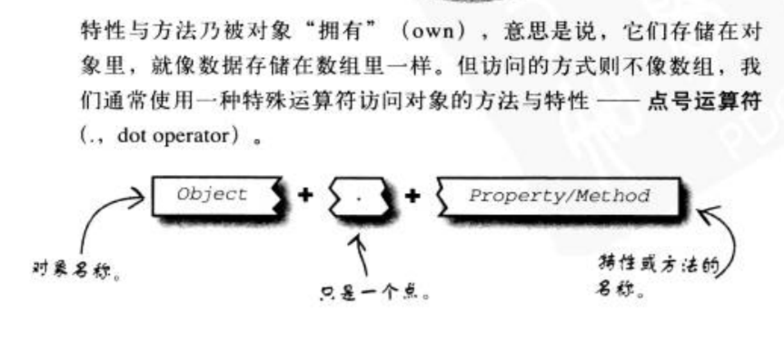
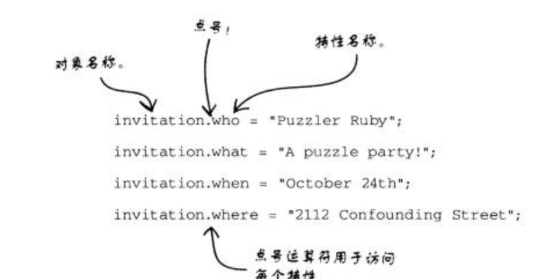
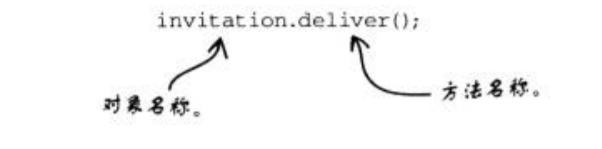

# 对象

在js中，对象也是一种特殊的数据类型(data type)；



看上面的图，表示的一封邀请函需要的信息和行为；

在js中，数据将被塑造成变量，行为被塑造成函数；


```js
var who;
var what;
var when;
var where;

function display(what, when, where){
    ....
}

function deliver(who){
    ....
}
```



在现实生活中，邀请函结合了数据与行为为一个单一实体--

也就是对象。

## 数据（变量） + 行为（函数） = 对象

js中对象的写法；

```js
var invitation = {
    who: '',
    what: '',
    when: '',
    where: '',
    display: function(){
        ....
    },
    deliver: function(){
        ....
    }

}
```

1.  js中对象（object）结合了数据和行为，变成了一种全然不同的数据结构，其中可以存储数据（data）也可以存储行为（function）
2.  可以把它想象成没有顺序的数组，它的编号由我们自己来指定
3. 它由大括号包起来，注意这里的大括号和函数和for的的大括号表示的不是同一个意思
跟在function 和for后面的大括号包含的是代码块， 单独的大括号表示一个对象

4. 对象在一个存储容器中链接变量和函数
5. 我们在对象定义了变量who然后后面跟的冒号，然后后面跟的是这个变量的值，每一个变量我们用逗号隔开

6. 在对象中，我们把变量称为属性(property)，把函数称为方法(method)；

## 访问对象中的属性和方法



### 以点号引用`对象成员`

点运算符在对象和属于对象的属性和方法间建立起引用。有点像每个人的名字代表自我个体，
姓氏代表他们所属的家族。 对象也能类比-- 特性名称（属性名和方法名）告诉我们特性本身，同上对象名称告诉我们特性所属的对象

点号运算符就是用于结合两者。






复习要点：

1. 对象是种特殊的数据结构，结合了数据与行为
2. 对象只是结合成单一结构体的变量和函数
3. 当变量被放在对象里时，它称为特性；当函数被放在对象里时，它称为方法
4. 引用属性和方式时需要提供对象的名称，后随点号运算符，在接上特性或方法的名称


