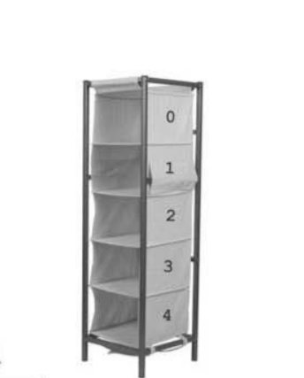
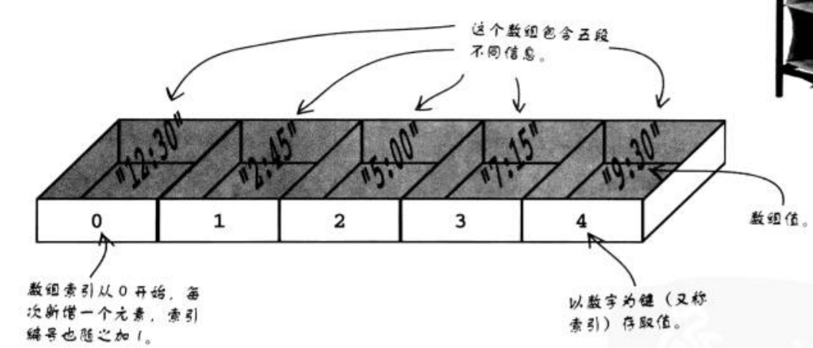
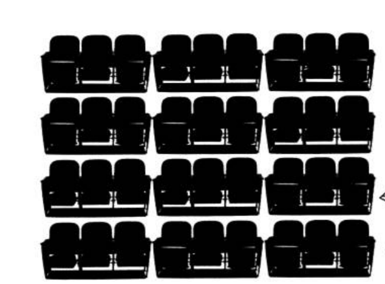
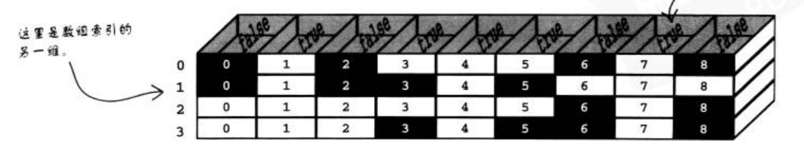

# 循环

循环可以理解成重复的做相同的事情，比如说上学时罚抄课文好多遍，流水线上的工人重复的
的工作；

我觉得任何枯燥乏味的事情都应该交给计算机或机器；

## for循环

js的重复机制我们成为循环，这个机制让我们重复代码。

尤其以for循环特别适合做已知次数的重复动作；


```js
for(var i=0; i<10;i++){
    console.log(i);
}
```

for循环由4个部分组成：

1. 初始化

初始化只于for循环起始时发生一次

2. 测试条件

测试条件检查，循环是否要再继续跑一轮

3. 动作

循环里的动作就是每一轮循环实际重复的代码

4. 更新

循环里的更新负责每一轮结尾更新任何循环变量


循环执行过程：

1 [ 2 3 4] [ 2 3 4 ] ....

2 3 4 为一轮循环

解刨循环：

```js
for(  初始化 ; 判断条件; 更新 ){
    执行代码块；
}
```

注意格式：

1. 小括号围起了循环的初始，判断条件和更新代码
2. 初始化和判断条件的代码后，各需加上分号
3. 重复执行代码块包含在大括号中，可以是一句或多句

练习：

完成下列代码：

提醒用户输入一个数，然后使用该数字作为for循环的倒数计时，就像

老电影片头的字幕一样(4, 3, 2, 1,开始)；

```js
var count = prompt('请输入一个大于0的整数', '10');
```


### 电影院选座


我们需要循环我们的每一排座位，找到 空着的座位

我们以一排为例，假设我们的一排有9个座位，其中一些是已售座位

我们以0和1代表我们的一个座位， 0代表已售座位， 1代表空着的座位：

```
0 1 0   1 1 0   1 1 1
```


但是在程序中应该怎么体现？

开始考虑以循环处理座位、 寻找空位的方式前，需要以js代码呈现各个座位是否已被占据。
因为一排有9个座位，可以用9个变量来表示；

```js
var seat1 = 0;
var seat2 = 1;
var seat3 = 0;
var seat4 = 1;
var seat5 = 1;
var seat6 = 0;
var seat7 = 1;
var seat8 = 1;
var seat9 = 1;
```

然后开始循环：

一个问题：不能在循环中改变变量名；

```js
for(var i=1;i<10;i++){
    if(seat1){
        .....
    }
}
```

如果‘每个座位都为一个变量’的设计不适用于循环，你该如何存储信息，以适应循环的处理方式

### 数组


js中有一种特殊的数据结构， 叫做数组(array)， 可用于存储多个数据于一个变量中；
数组只有一个名字，这点与一般变量类似---但数组有多个存储位置。 就像你家的储物柜，明明只是一件家具，但有很多格存储空间。



数组里的每个元素，都有两块信息组成： `值`(value)与具有唯一性的`键`(key)
，需以`键`访问`值`；数组的键通常是从0开始计算、逐次加1的连续编号。数字编号键又称为索引（index），


#####　定义数组




```js
var showTime = ["12:30", "2:45", "5:00", "7:15", "9:30"];
```

1. showTime 变量名
2. 用中括号包围
3. 列出所有数组值，以逗号分隔

就可以根据索引值(键值)取到数组中的值了

通过方括号来取；

```js
alert("The late movie starts at " + showTime[4] + ".");
```


我们接着上面的例子

我们先用for看看每个位置的情况：

```js
var seats = [0, 1, 0,1, 1, 0, 1, 1, 1];

for(var i=0;i<seats.length;i++){
    if(seats[i]==1){
        alert('座位'+i+'为空位');
    }
    else{
        alert('座位'+i+'为已售座位');
    }
}
```

1. 既然数组索引从0开始，循环计数也从0开始
2. `seats.length` 数组的length属性 表明了数组的长度，应为seats数组中有9个值，所以它的length属性为9，它是一个变化的值，当数组的长度发生改变时，数组的length数组相应发生改变
3. `seats[i]` 其实它把循环计数当做数组的索引，以数组中的每个值

现在我们把座位在我们的html中显示出来

```html
<div style="margin-top:75px; text-align:center">
      
      
      
      
      
      
      
      
      <br />
      <input type="button" id="findseat" value="找座位" />
    </div>
<script>
var seats = [0, 1, 0,1, 1, 0, 1, 1, 1];

for(var i=0;i<seats.length;i++){
    if(seats[i]==1){
        document.getElementById('seat'+i).src = 'seat_avail.png';//src是html元素的属性
    }
    else{
        document.getElementById('seat'+i).src = 'seat_unavail.png';
    }   
}

var input = document.getElementById('findseat');

input.onclick = function(){

    for(var i=0;i<seats.length;i++){
        if(seats[i]==1){
            var accept = confirm("Seat " + (i + 1) + " 空闲. 是否选择?");//需要用户确认
            if(accept){
                document.getElementById('seat'+i).src = 'seat_select.png';//如果用户选择ｏｋ，　选择该座位
            }
            
        }
    }
}
</script>
```

问题来了：　技术上，可以找到单一空位，却出现了程序不知何时结束的问题
就算用户选择了某个空位并按下ｏｋ，程序仍然会继续运行，继续跑过剩余空位

## 如何结束循环

关键字break;

当循环遇到break语句，它立刻结束，完全无视条件句，它的作用是立刻跳出循环

所以我们改动下代码，当选择了座位之后不再进行循环；


```js
input.onclick = function(){

    for(var i=0;i<seats.length;i++){
        if(seats[i]==1){
            var accept = confirm("Seat " + (i + 1) + " 空闲. 是否选择?");//需要用户确认
            if(accept){
                document.getElementById('seat'+i).src = 'seat_select.png';//如果用户选择ｏｋ，　选择该座位
                break;
            }
            
        }
    }
}
```

我们现在解决了一排座位的选座问题，但是并不是只有一排座位；




电影院数据建模:

想扩展成很多排座位，需要扩展数组




数组里的数组，二维数组；

```js
var seats = [
    [0, 1, 0,1, 1, 0, 1, 1, 1],
    [0, 1, 0,1, 1, 0, 1, 1, 1],
    [0, 1, 0,1, 1, 0, 1, 1, 1],
    [0, 1, 0,1, 1, 0, 1, 1, 1]
]
```

数组中的数据又是一个数组；

访问二维数组数据的两个键：

访问二维数组与访问一维数组的方式没有什么不一样，只不过我们要多提供一下信息：额外数组的索引，说的跟精确一点，你要指定行(row)和列(column)的索引，以指出数据在数组中的位置。

例如想取得第二排第4张座椅的值:

```js
alert( seats[1][3] );
```

数组中第2行的索引是1（索引编号从0开始）；
数据行中第4个元素的索引是3（索引编号从0开始）；

用循环处理一个多维数组，牵涉到为每一维制作一层嵌套循环，所以，二维数组就需要
两层循环，其中一个循环在另一个里面。 外层循环处理数组数据的每一行，内层循环则处理每行中的每一列


```js
for(var i=0;i<seats.length;i++){
    for(var j=0;j<seats[i].length;j++){
        if(seats[i][j]==1){
            alert('第'+i+'行，第'+j+'列，空位');
        }
        else{
            alert('第'+i+'行，第'+j+'列，已售');
        }
    }
}
```

作业： 在多行座位中选择座位


