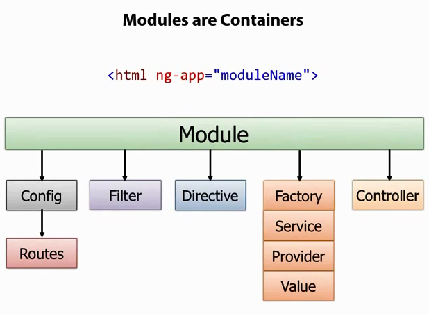
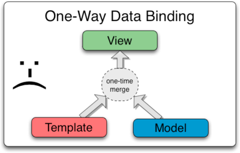
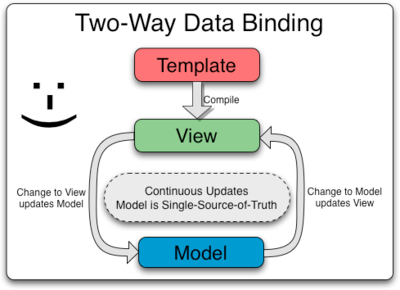

# 什么是angularJs？
- 基于javascript开发的客户端应用框架，使我们可以更加快捷，简单的开发web应用。
- 诞生于2009年，后来被google收购，用在了很多项目中。
- 适用于CRUD应用或者SPA单页面网站的开发。

# angularJs资源

- http://www.angularjs.org/
- https://www.github.com/angular/
- http://www.angularjs.cn/
- http://www.ngnice.com/

# 下载
- http://www.bootcdn.cn/angular.js/
- bower install angular

<!-- # 概念概览 -->
<!-- - MVC
- Template 模版
- Directive 指令 
- Scope 
- Expressions 表达式
- Compiler 
- Filter 过滤器
- Data Binding 数据绑定
- Controller 控制器
- Dependency Injection 依赖注入
- Module 模块
- Service 服务 -->

# AnguarJS的4大核心特性演示
- MVC
- 模块化与依赖注入
- 指令与UI控件
- 双向数据绑定


# MVC
MVC全名是Model View Controller，是模型(model)－视图(view)－控制器(controller)的缩写，一种软件设计典范，用一种业务逻辑、数据、界面显示分离的方法组织代码


Model：数据模型层
View：视图层，负责展示
Controller：业务逻辑和控制逻辑

好处：职责清晰，代码模块化

```html
<!DOCTYPE html>
<html lang="en">
<head>
    <meta charset="UTF-8">
    <title>Document</title>
</head>
<body ng-app="app">
    <div ng-controller="Ctrl">
        <p>{{someText}}</p>
    </div>
<script src="angular.js"></script>
<script>
var app = angular.module('app', []);

app.controller('Ctrl', function($scope){
    $scope.someText = 'hello world!';
});
</script>
</body>
</html>
```

对应上面的代码：
可以把`<p>{{someText}}</p>` 看作view
可以把`Ctrl`看作Controller
可以把`$scope`看作Model


# 模块
模块定义了一个应用程序。
模块是应用程序中不同部分的容器。
angularjs中一切都是从模块开始的。



## angular.module
angularjs中的模块是由angular.module函数来定义的

```js
var app = angular.module('app', []);
```
传入两个参数:
第一个参数是模块名
第二个参数是该模块依赖的其他模块,[]表示不依赖其他模块

返回模块实例

# 依赖注入
```js
app.controller('Ctrl', function($scope){
    $scope.someText = 'hello world!';
});
```

```html
<div ng-controller="Ctrl">
```

这个地方的$scope 是一个参数，
但又不仅仅是参数——你换个名字代码就不能正常运行了。

angular会自动根据我们的参数名，来查找相关的服务，这个过程我们成为依赖注入


# directive 指令
```html
<!DOCTYPE html>
<html lang="en">
<head>
    <meta charset="UTF-8">
    <title>Document</title>
</head>
<body ng-app="app">
    <hello></hello>

<script src="angular.js"></script>
<script>
var app = angular.module('app', []);
app.directive('hello', function(){
    return {
        restrict: 'E',
        template: '<div>hello world</div>',
        replace: true
    }
});
</script>
</body>
</html>
```
基于我们对HTML元素的理解,指令本质上就是AngularJS扩展具有自定义功能的HTML元素。

# 双向数据绑定


我们先来看看单向数据绑定：

一般的流程是,我们先把模版写好,然后了加上我们的数据,这个数据了可能是
从后端读进来的,我们把模块和数据结合在一起,通过我们的数据绑定机制,吧它
生成一段html标签,插入到文档流当中

缺点: html标签生成完以后，就没有办法再改变了, 但我们有新的数据
时，我们只有再来一遍，重新生成，然后把它替换掉




双向数据绑定：

视图和数据是对应的，当视图上面发生变化的时候，它希望数据模型
也立刻发生变化；当数据模型发生变化的时候，视图会自动更新；

在视图上，一般什么会发生变化？

表单，表单是收集用户输入的，这些很容易发生变化



```html
<!DOCTYPE html>
<html lang="en">
<head>
    <meta charset="UTF-8">
    <title>Document</title>
</head>
<body ng-app="app">
<input type="text" ng-model="text">
<p>{{text}}</p>

<script src="angular.js"></script>
<script>
var app = angular.module('app', []);
</script>
</body>
</html>
```


