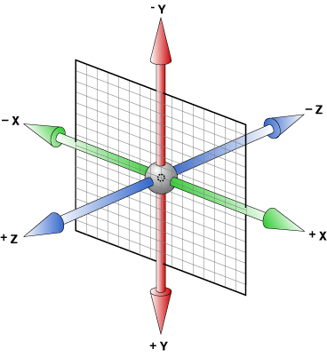
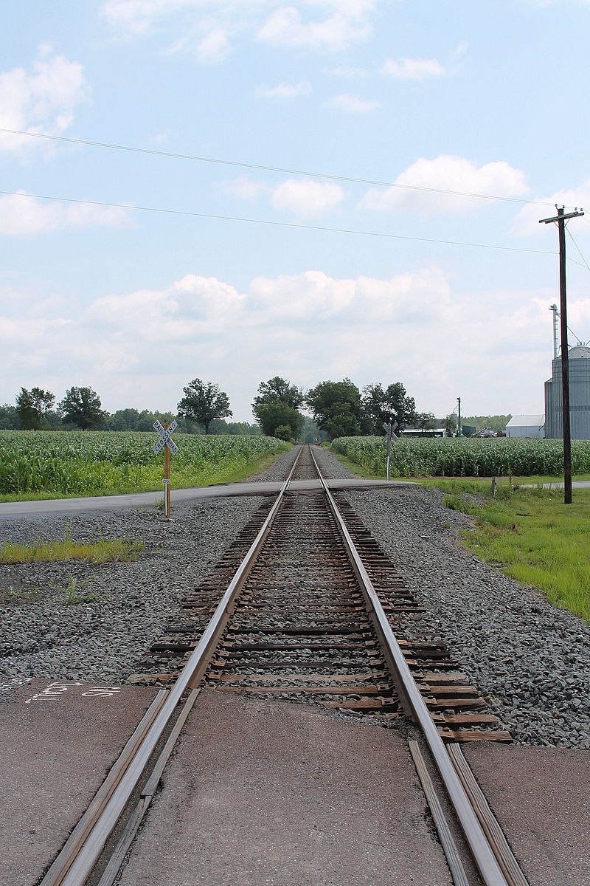

#3d变形

使用二维变形能够在水平和垂直轴上改变元素, 然而还有一个轴,沿着它可以改变元素, z轴



z轴的正方向就是垂直屏幕向外

### 相关函数
+ 旋转 rotateX() rotatY() rotateZ() 
+ 位移 translateZ()
+ 缩放 scaleZ() 


###  旋转
rotateX() x轴旋转


rotateY() y轴旋转


rotateZ() z轴旋转


<p data-height="266" data-theme-id="0" data-slug-hash="eZPdXV" data-default-tab="result" data-user="lulupy" data-embed-version="2" class="codepen">See the Pen <a href="http://codepen.io/lulupy/pen/eZPdXV/">eZPdXV</a> by lulu (<a href="http://codepen.io/lulupy">@lulupy</a>) on <a href="http://codepen.io">CodePen</a>.</p>
<script async src="//assets.codepen.io/assets/embed/ei.js"></script>


### perspective
上面的例子纸牌沿x轴旋转了45度, 纸牌看上只是沿y轴缩小了一些, 并没有看到3d的效果,我们通常子在它的父元素上设置perspective属性来激活3d效果

perspective属性的值决定了3D效果的强烈程度，可以认为是观察者到页面的距离。值越大距离越远，视觉上的3D效果就会相应的减弱。perspective: 2000px; 会产生一个好像我们使用望远镜看远方物体的3D效果，perspective: 100px;会产生一个小昆虫看大象的效果。

### perspective-origin
定义了消失点的位置,如当你沿着铁路线去看两条铁轨，沿着公路线去看两边排列整齐的树木时，两条平行的铁轨或两排树木连线交与很远很远的某一点，这点在透视图中叫做消失点。



<p data-height="266" data-theme-id="0" data-slug-hash="bpmBVq" data-default-tab="result" data-user="lulupy" data-embed-version="2" class="codepen">See the Pen <a href="http://codepen.io/lulupy/pen/bpmBVq/">bpmBVq</a> by lulu (<a href="http://codepen.io/lulupy">@lulupy</a>) on <a href="http://codepen.io">CodePen</a>.</p>
<script async src="//assets.codepen.io/assets/embed/ei.js"></script>

上面的例子我们定了perspective-origin的位置为纸牌父元素的右上角
```css
div{
    perspective: 2000px;
  perspective-origin: 500px 0px
}
```


### backface-visibility 

backface-visibility属性指定当元素背面朝向观察者时是否可见。元素的背面总是透明的，当其朝向观察者时，显示正面的镜像。

在某些情况下，我们不希望元素内容在背面可见，比如实现翻牌效果。

### transform-style

transform-style属性指定了，该元素的子元素是（看起来）位于三维空间内，还是在该元素所在的平面内被扁平化。

如果被扁平化，则子元素不会独立的存在于三维空间。


