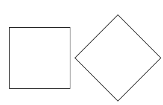

# transform(变形)
CSS3中可以通过transform属性修改元素的变形、旋转、缩放、倾斜特性，在CSS3中transform主要包括以下几种：旋转rotate、倾斜skew、缩放scale和移动translate以及矩阵变形matrix
```
transform ： none | <transform-function> [ <transform-function> ]*
```
transform中使用多个变形函数时需要有空格隔开

适用元素     [transformable elements](https://www.w3.org/TR/css-transforms-1/#transformable-element)


### rotate(旋转)
可以通过rotate使元素旋转一定的度数
```css
transform:rotate(30deg);
```
+ 顺时针旋转一定角度，　单位是角度deg（degree）
+ 旋转之后元素仍占据原来位置，实际上所有的transform都是这样，缩放、位移等都不会改变元素占据的位置
+ 元素旋转的的基点默认是中心(坐标轴原点)，可以通过transform-origin属性改变
```css
transform:rotate(30deg); 
transform-origin: 0% 0%;
```


transform-origin的取值可以是top, bottom, left, right, center, 或百分比，或长度值

transform-origin属性对下面介绍的transform都有作用


### 坐标轴


### translate(位移)
可以通过translate使元素平移
```
transform:translate(x,y);
```
###### 例子
```css
transform:translate(200px,150px);
```

也可以简单只移动一个坐标
```css
transform:translateX(100px);
transform:translateY(100px);
```

### scale(缩放)
可以通过scale使元素缩放一定的比例，和translate类似，也有三个方法
```css
scale(x,y) /*使元素水平方向和垂直方向同时缩放*/
scaleX(x) /*元素仅水平方向缩放*/
scaleY(y) /*元素仅垂直方向缩放*/
```

```css
transform:scale(2, 0.5);
transform:scaleY(0.3);
transform:scaleY(2);
transform:scale(3);
```

### skew(倾斜)
可以通过skew使元素扭曲一定的度数，和上面一样也有三中类似的用法
```
transform:skew(10deg, 20deg);
transform:skewX(10deg);
transform:skewY(10deg);
transform:skew(10deg);
```


### matrix(矩阵)
[理解CSS3 transform中的Matrix](http://www.zhangxinxu.com/wordpress/2012/06/css3-transform-matrix-%E7%9F%A9%E9%98%B5/)


### 工具
[CSS3 Tool](http://isux.tencent.com/css3/tools.html)


### transform多值的顺序问题
当transforrm属性同时拥有多个变换函数时,顺序的不同,得到的结果可能也会不同


```html
<div class="item item1"></div>
<div class="item item2"></div>
```

```css
.item{
  width: 100px;
  height: 100px;
  border: 1px solid #111;
  position: absolute;
  top: 300px;
  left: 300px;
}
```


```css
.item2{
  transform: translate(130px) rotate(45deg);
}
```
先x轴移动130px, 然后旋转45度




```css
.item2{
  transform: rotate(45deg) translate(130px);
}
```
先旋转45度, 然后x轴移动130px


我们会发现如果是先旋转, 然后x轴移动130px, 它不只是在x轴移动了, 在y轴也移动了, 这里个人的理解是旋转之后, 我们的参考坐标发生了变化,向这样


当旋转45度后，元素的整个坐标系都旋转了45度

### 表盘
<p data-height="266" data-theme-id="0" data-slug-hash="GZXLZL" data-default-tab="result" data-user="lulupy" data-embed-version="2" class="codepen">See the Pen <a href="http://codepen.io/lulupy/pen/GZXLZL/">GZXLZL</a> by lulu (<a href="http://codepen.io/lulupy">@lulupy</a>) on <a href="http://codepen.io">CodePen</a>.</p>
<script async src="//assets.codepen.io/assets/embed/ei.js"></script>

