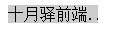

# 文本

<!-- word-spacing
letter-spacing
vertical-align
text-decoration
text-indent
text-align 
line-height
text-transform
text-shadow
white-space
direction  -->

### text-overflow
text-overflow用来设置是否使用一个省略标记（...）标示对象内文本的溢出。


```css
text-overflow: clip | ellipsis; 
```

+ clip: 隐藏超出文本(默认值)
+ ellipsis:　超出部分使用省略号


###### 一个例子
```html
<div>十月驿前端开发学习指南</div>
```
```css
div{
  width: 90px;
  white-space:nowrap; /*强制文本在一行内显示*/ 
  text-overflow:ellipsis;
  overflow: hidden; /*溢出内容为隐藏*/
}
```
还须定义强制文本在一行内显示（white-space:nowrap）及溢出内容为隐藏（overflow:hidden），只有这样才能实现溢出文本显示省略号的效果




### text-shadow
```
text-shadow: x轴(X Offset) y轴(Y Offset)  模糊半径(Blur)  颜色(Color)
```
和box-shdow很像

<p data-height="266" data-theme-id="dark" data-slug-hash="WwgmXB" data-default-tab="result" data-user="lulupy" data-embed-version="2" class="codepen">See the Pen <a href="http://codepen.io/lulupy/pen/WwgmXB/">WwgmXB</a> by lulu (<a href="http://codepen.io/lulupy">@lulupy</a>) on <a href="http://codepen.io">CodePen</a>.</p>
<script async src="//assets.codepen.io/assets/embed/ei.js"></script>

[text-shadow参考](https://developer.mozilla.org/zh-CN/docs/Web/CSS/text-shadow)


文字阴影应用:

最简单用法:

```css
text-shadow:2px 2px 4px black
```

阴影叠加:

```css
text-shadow:2px 2px 0px red, 2px 2px 4px green;
```
先渲染后面的，再渲染前面的

几个好玩的例子:


层叠：
```css
color:red; 
font-size:100px; 
font-weight:bold; 
text-shadow:2px 2px 0px white, 4px 4px 0px red;
```

光晕：
```css
color:white; 
font-size:100px; 
text-shadow:0 0 10px #fff, 
            0 0 20px #fff, 
            0 0 30px #fff, 
            0 0 40px #ff00de, 
            0 0 70px #ff00de, 
            0 0 80px #ff00de, 
            0 0 100px #ff00de, 
            0 0 150px #ff00de;
```

火焰文字：
```css
div{
  text-shadow: 0 0 20px #fefcc9, 
              10px -10px 30px #feec85, 
              -20px -20px 40px #ffae34, 
              20px -40px 50px #ec760c, 
              -20px -60px 60px #cd4606,
               0 -80px 70px #973716, 
               10px -90px 80px #451b0e; 
  font-family:Verdana, Geneva, sans-serif; 
  font-size:100px; 
  font-weight:bold; 
  color:white;
}
```


### 文字描边

-webkit-text-stroke:宽度 颜色

只支持-webkit内核浏览器

```css
div{
  -webkit-text-stroke:3px red;
}
```

### direction  
定义文字排列方式(全兼容)

- Rtl 从右向左排列
- Ltr 从右向左排列
- 注意要配合unicode-bidi 一块使用


```css
p{
  width:300px;
  border:1px solid #000;
  font:14px/30px "宋体";
  direction:rtl;
  unicode-bidi:bidi-override;
}
```
# web字体

我们在CSS中经常指定字体

```css
font-family: '微软雅黑', '宋体', Arial;
```
这里用的字体是用户计算机本地字体，如果找不到声明的字体就会使用相应语言默认的字体

很多时候出于美观原因我们希望使用一些不是所有客户端都有的字体，比如一些美术字体

### @font-face

CSS3赋予了我们使用自定义字体的能力，我们可以把字体文件像图片一样放在服务器或者CDN，然后在页面通过CSS指定下载到客户端，这样客户端就可以使用了
```css
@font-face {
    font-family : 字体名称;
    src : 字体文件在服务器上的相对或绝对路径;
}

body{
    font-family: 字体名称;
}
```


###### 一个例子
```html
<p>sdfsdfsdfsdfsadfsadfasdfsadfasdfasdf</p>
```

```css
@font-face{
  font-family: "my font";
  src: url(https://fonts.gstatic.com/s/dancingscript/v6/DK0eTGXiZjN6yA8zAEyM2Ud0sm1ffa_JvZxsF_BEwQk.woff2) format('woff2');
}
body{
  font-family: "my font";
  font-size: 20px;
  letter-spacing: 5px;  /*字符间距*/
}
```
###  字体文件格式
存储字体的格式现在还没有一个标准，　各个浏览器支持的字体格式并不统一

#### WOFF
WOFF是Web Open Font Format简写。这种字体格式专门用于网上，由Mozilla联合其它几大组织共同开发。WOFF字体通常比其它字体加载的要快些，因为使用了OpenType (OTF)和TrueType (TTF)字体里的存储结构和压缩算法。这种字体格式还可以加入元信息和授权信息。

这种字体格式有君临天下的趋势，因为所有的现代浏览器都开始支持这种字体格式。

支持这种字体的浏览器有【IE9+,Firefox3.5+,Chrome6+,Safari3.6+,Opera11.1+】

#### SVG / SVGZ
Scalable Vector Graphics (Font). SVG是一种用矢量图格式改进的字体格式，体积上比矢量图更小，适合在手机设备上使用。只有iPhone上的Safari(4.1)之前的版本支持它。目前火狐、IE都不支持SVG字体格式。火狐推迟对SVG字体的支持，重点放在WOFF格式上。SVGZ是压缩版的SVG。

支持这种字体的浏览器有【Chrome4+,Safari3.1+,Opera10.0+,iOS Mobile Safari3.2+】

#### EOT
OpenType Font 和 TrueType Font。这种格式容易被复制(非法的)，这才催生了WOFF字体格式。

.ttf字体是Windows和Mac的最常见的字体，是一种RAW格式，因此他不为网站优化,支持这种字体的浏览器有

【IE9+,Firefox3.5+,Chrome4+,Safari3+,Opera10+,iOS Mobile Safari4.2+】

.otf字体被认为是一种原始的字体格式，其内置在TureType的基础上，所以也提供了更多的功能,支持这种字体的浏览器有

【Firefox3.5+,Chrome4.0+,Safari3.1+,Opera10.0+,iOS Mobile Safari4.2+】；


### 兼容更多的浏览器
```css
@font-face {
    font-family: 'YourWebFontName';
    src: url('YourWebFontName.eot'); /* IE9 Compat Modes */
    src: url('YourWebFontName.eot?#iefix') format('embedded-opentype'), /* IE6-IE8 */
             url('YourWebFontName.woff') format('woff'), /* Modern Browsers */
             url('YourWebFontName.ttf')  format('truetype'), /* Safari, Android, iOS */
             url('YourWebFontName.svg#YourWebFontName') format('svg'); /* Legacy iOS */
}

body{
    font-family: 'YourWebFontName';
}
```

### 更多的字体
+ bootstrap自带
+ [Google Web Fonts](https://www.google.com/fonts/)
+ [Dafont.com](http://www.dafont.com/)


