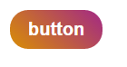
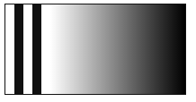

# gradient(渐变)

生成渐变颜色的背景图片

CSS3渐变分为linear-gradient(线性渐变)和radial-gradient(径向渐变)

### linear-gradient(线性渐变)

在线性渐变过程中，颜色沿着一条直线过渡：从左侧到右侧、从右侧到左侧、从顶部到底部、从底部到顶部或着沿任何任意轴

###### 用法
```
background-image:　linear-gradient（方向，　颜色，　颜色，．．）
```

+ 第一个参数为渐变的方向，　取值为角度（如45deg）或方向关键字(top, bottom等)
  * 0deg == top 顺时针
  * 注意: 几个浏览器实现前缀，在旧稿的规格中 0deg 是指右部而不是顶部。当是混合前缀和标准线性渐变时要特别注意角度的值。一个简单的公式：90 - x = y，x 是标准用法，而 y是非标准，浏览器引擎前缀用法。
+ 第二个参数开始是一个颜色列表, 表示起始点到结束点之间渐变颜色;每个颜色可以加入百分比表示颜色开始位置

```css
background-image: linear-gradient(to top, blue, red); /*方向值为方向关键字*/
background-image: linear-gradient(45deg, blue, red); /*方向值为角度值*/
background-image: linear-gradient( 0deg, blue, green 40%, red );/*多个颜色, 颜色加入百分比*/
```


###### 一个按钮
```css
.btn{
    margin: 10px;
    padding: 10px 20px;
    font-size: 20px;
    font-weight: bold;
    color: #fff;
    border: none;
    border-radius: 20px;
    background: #D38312; /*渐进增强*/
    background: linear-gradient(45deg, #D38312 10%,#A83279 90%);
     
}
```



###### 条纹
```css
div{
  height: 100px;
  width: 200px;
  border: 1px solid #111;
  background: #111;
  background-image: linear-gradient(to right, #fff, #fff 5%, #111 5%, #111 10%, #fff 10%, #fff 15%, #111 15%, #111 20%, #fff 20%, #fff 25%, black);
}
```



### radial-gradient(径向渐变)
CSS3径向渐变是圆形或椭圆形渐变。颜色不再沿着一条直线轴变化，而是从一个起点朝所有方向混合。

###### 用法

```
radial-gradient: （形状 大小  at 位置, 颜色, 颜色,...）;
```

+ 形状: 定义渐变的形状,可选参数, 取值为circle(圆)或ellipse(椭圆),如果不设置则根据元素的形状来确定
+ 大小:　定义渐变的大小，可选值，默认为径向渐变的半径长度为从圆心到离圆心最远的边
    * 如果渐变形状为圆形，　取值为长度值（如，50px, 10em），此值不不能负值。
    * 如果渐变形状为椭圆，　取值为两个值，　第一个值代表椭圆的水平半径，第二个值代表垂直半径。这两个值除了使用长度值<length>定义大小之外还可以使用<percentage>来定义这两半径大小。使用<percentage>定义值是相对于径向渐变容器的尺寸。同样不能为负值。
    * 也可以是关键字（最近端，最近角，最远端，最远角，包含或覆盖 (closest-side, closest-corner, farthest-side, farthest-corner, contain or cover)）;
注意firefox目前只支持关键字


+ 位置：　定义径向渐变的圆心位置，用于确定元素渐变的中心位置。可选参数，　默认为元素中心，也是用两个值表示，第一个代表横坐标，　第二个代表纵坐标，取值可以是 长度值<length>，百分比<percentage>，或方向关键字（top, bottom, right, left）. 注意加上at关键字
+ 颜色列表： 用法和线性渐变一样

```css
div{
  height: 100px;
  width: 200px;
  border: 1px solid #111;
}
```
```css
background-image:  radial-gradient(red, blue);
background-image:  radial-gradient(circle, red, blue);/* 指定形状为圆 */
background-image:  radial-gradient(circle 50px, red, blue);/* 指定圆的大小 */
background-image:  radial-gradient(50px 25px, red, blue);/* 指定椭圆的大小 */
background-image:  radial-gradient(25% 25%, red, blue);/* 用百分比指定椭圆的大小 */
background-image:  radial-gradient(circle 50px at center top, red, blue);/* 指定圆心的位置 */
background-image:  radial-gradient(circle 50px at 50% 0% , red, blue);/*用百分比 指定圆心的位置 */
background-image:  radial-gradient(circle 50px at  100px 0px , red, blue);/*用长度值 指定圆心的位置 */
```

### 工具
[Ultimate CSS Gradient Generator](http://www.colorzilla.com/gradient-editor/)


### 综合示例
<p data-height="1074" data-theme-id="dark" data-slug-hash="BKObvE" data-default-tab="result" data-user="lulupy" data-embed-version="2" class="codepen">See the Pen <a href="http://codepen.io/lulupy/pen/BKObvE/">BKObvE</a> by lulu (<a href="http://codepen.io/lulupy">@lulupy</a>) on <a href="http://codepen.io">CodePen</a>.</p>
<script async src="//assets.codepen.io/assets/embed/ei.js"></script>


### 参考
[再说CSS3渐变——线性渐变](http://www.w3cplus.com/css3/new-css3-linear-gradient.html)


[再说CSS3渐变——径向渐变](http://www.w3cplus.com/css3/new-css3-radial-gradient.html)


