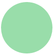
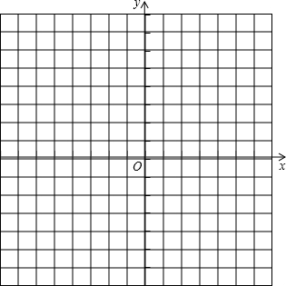
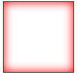
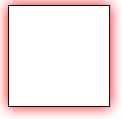
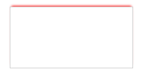
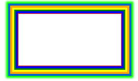

# border
css3在很大程度上拓展了border的样式，让我们可以做出更加丰富的效果

### border-radius
border-radius属性是向元素添加圆角边框。

###### 使用方法
```css
border-radius:10px; /* 所有角都使用半径为10px的圆角 */ 
```

```css
border-radius: 5px 4px 3px 2px; /* 四个半径值分别是左上角、右上角、右下角和左下角，顺时针 */ 
```


###### 圆

方法:　把高度(height)和宽度(width)设为相等，并且设置圆角半径(border-radius)的值与高度(height)的值一致．
```css
div{
    height:100px;
    width:100px;/*与height相等*/
    background:#9da;
    border-radius:50px;/*半径至少设置为height的值*/
}
```


###### 实心上半圆
方法:　把高度(height)设为宽度（width）的一半，并且只设置左上角和右上角的半径与元素的高度一致．
```html
div{
    height:50px;/*是width的一半*/
    width:100px;
    background:#9da;
    border-radius:50px 50px 0 0;/*半径至少设置为height的值*/
}
```


###### 课堂任务
* 实现实心左半圆形,  实心左右圆形, 实心下半圆形
* 实现1/4半圆


### 工具
[圆角边框发生器](https://developer.mozilla.org/zh-CN/docs/Web/CSS/CSS_Background_and_Borders/%E5%9C%86%E8%A7%92%E8%BE%B9%E6%A1%86%E5%8F%91%E7%94%9F%E5%99%A8)

###  box-shadow
box-shadow是向盒子添加阴影。支持添加一个或者多个。
```css
box-shadow:inset x-offset y-offset blur-radius spread-radius color
```
box-shadow属性至多有6个参数设置
+ inset: 阴影类型, 可选参数, 如果不设值，其默认的投影方式是外阴影；如果取其唯一值inset,就是将外阴影变成内阴影
+ x-offset: 阴影水平偏移量, 如果为正值, 阴影向左偏移, 如果为负值, 阴影向右偏移
+ y-offset: 阴影垂直偏移量, 如果为正值, 阴影向下偏移, 如果为负值,阴影向上偏移
+ blur-radius: 模糊半径, 可选参数, 只能为正值, 数值越大, 模糊效果越明显
+ spread-radius: 扩展半径, 可选参数, 如果值为正，则整个阴影都延展扩大，反之值为负值是，则缩小
+ color:　阴影颜色

[box-shadow测试](http://www.w3school.com.cn/tiy/c.asp?f=css_box-shadow)

###### 关于偏移量



这张图可以帮助我们记忆偏移量的规则(同样适用于绝对定位, 元素的移动(translate)等跟位置相关的场景), 我们可以在想象一个坐标轴, 以x-offset为例, 当x-offset为正值的时候, 相当于原点向左移动了, 为负数的时候, 相当与原点向右移动了, y-offset也是同样的道理


###### 内阴影
```css
div{
    height:100px;
    width:100px;
    border: 1px solid #111;
    box-shadow: inset 0px 0px 20px red;
}
```


###### 外阴影
```css
div{
    height:100px;
    width:100px;
    border: 1px solid #111;
    box-shadow:  0px 0px 20px red;
}
```


###### 单边阴影
方法: 先设置模糊半径, 设置扩展半径为负数, 缩小阴影大小, 直到看不到阴影, 然后将阴影向上移动.
```css
div{
    margin: 30px;
    width: 200px;
    height: 100px;
    border: 1px solid #ccc;
    box-shadow: 0px -4px 5px -3px red;
}
```

###### 课堂任务
完成下面展示效果:
<p data-height="500" data-theme-id="dark" data-slug-hash="vGzERB" data-default-tab="result" data-user="lulupy" data-embed-version="2" class="codepen">See the Pen <a href="http://codepen.io/lulupy/pen/vGzERB/">vGzERB</a> by lulu (<a href="http://codepen.io/lulupy">@lulupy</a>) on <a href="http://codepen.io">CodePen</a>.</p>
<script async src="//assets.codepen.io/assets/embed/ei.js"></script>


###### 多重阴影
```css
div{
    width: 200px;
    height: 100px;
    border: 1px solid #ccc;
    margin: 30px;
    box-shadow: 0 0 0 1px red, 
                0 0 0 5px blue, 
                0 0 0 8px green, 
                0 0 0 12px yellow, 
                0 0 0 16px orange, 
                0 0 0 20px #06c,
                0 0 5px 24px lime;/*每个阴影用逗号隔开, 最先定义的显示在最上面*/
}
```

 
######  综合应用-3d搜索框
<p data-height="266" data-theme-id="dark" data-slug-hash="PNdwVG" data-default-tab="result" data-user="lulupy" data-embed-version="2" class="codepen">See the Pen <a href="http://codepen.io/lulupy/pen/PNdwVG/">PNdwVG</a> by lulu (<a href="http://codepen.io/lulupy">@lulupy</a>) on <a href="http://codepen.io">CodePen</a>.</p>
<script async src="//assets.codepen.io/assets/embed/ei.js"></script>


###  border-image
属性用来给元素边框添加背景图片; 浏览器应用了 border-image 则不再应用 border-style.

border-image是由以下几个属性组成的:
- border-image-source: none　（默认值）
- border-image-slice: 100%　（默认值）
- border-image-width: 1　（默认值）
- border-image-repeat: stretch　（默认值）

#### border-image-source（图片地址）
```css
    border-image-source: url(xx.png);
```

#### border-image-slice (图片裁剪)
```css
border-image-slice: [<number> | <percentage>]{1,4} && fill?
```

取值为长度或百分比（相对于图片）　分别设置四个变，　简写遵循上右下左原则


fill
显示中间的图片

#### border-image-width (边框大小)
简写遵循上右下左原则


#### border-image-repeat (图片的排列方式)
或为单个值，设置所有的边框；或为两个值，分别设置水平与垂直的边框。


可选值:

- stretch 拉伸图片以填充边框
- repeat 平铺图片以填充边框(从中间向两边平铺,超出部分裁剪)
- round 类似于repeat，不过是整数次平铺（不会裁剪，而是适当的拉伸图片）


