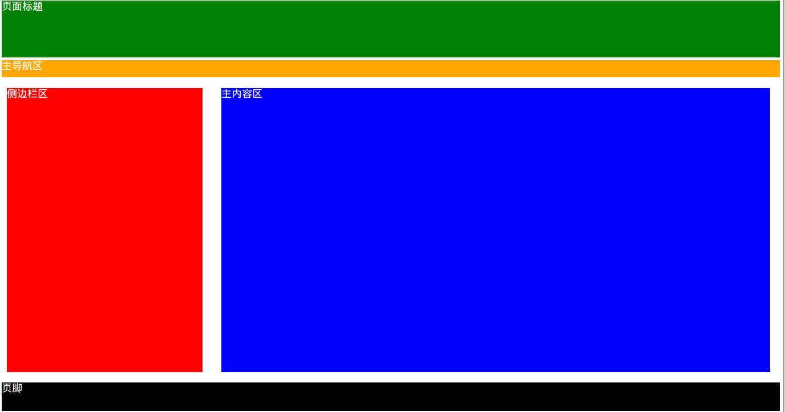

### 了解html5的语义
html5新增的语义元素是容易被人们遗忘的，但确实很重要的，它使我们的html代码可读性更强，更容易维护



> html4
```html
<!DOCTYPE html>
<html lang="en">
<head>
    <meta charset="UTF-8">
    <title>页面布局: div</title>
</head>
<body>
    <div class="header">页面标题</div>
    <div class="nav">主导航区</div>
    <div class="aside">侧边栏</div>  
    <div class="main">主内容区</div>
    <div class="footer">页脚</div>
</body>
</html>
```
<!-- 
这是一个页面设计草图，它由几大功能区域组成，分别...,这是大多数网页的组成部分，你的html源代码可能是这个样子（展示代码），每个区域都是一个div标签，每个div标签都有一个class属性，他们的值分别为header... ,这是html4中大多数网页常用的模式，但是不同的开发人员会使用不同的类名
 -->

> html5
```html
<body>
    <header>页面标题</header>
    <nav>主导航区</nav>
    <aside>侧边栏区</aside>
    <main>主内容区</main>
    <footer>页脚</footer>
</body>
```
 
 在html5中，我们直接使用新增加的更具语义化的标签，header..，来表示页面的每个部分，这些标签比div标签有更丰富的含义，让开发人员更直观的了解页面每部分的功能，同上，搜索引擎和视觉障碍人事使用的屏幕阅读器也能更方便的识别页面的每个部分 
 

###### 为什么要语义化
+ 手持移动设备的无障碍阅读

手持移动设备如PDA、智能手机等可能对CSS的解析能力较弱，这时可能就需要更语义的标签来体现一个页面的易读性
盲人等一些障碍人士的更好地阅读
屏幕阅读器对不同标签所发出的声音是不同的，使用更语义的标签以能传达不同信息的重要性

+ 搜索引擎的友好收录

虽然各大搜索引擎的排名规则不断的再变化，但规则里的正则始终是要匹配标签的，如果能用更语义的标签，蜘蛛爬行能够根据标签的使用来确定上下和各关键字的权重。

+ 技术趋势所趋

正如html诞生时的初衷那样，各个标签的本义就是希望能在特定的地方使用合适的标签，而不是去用样式来表现一个不语义的标签。html5新增了更多的语义化的标签，原本用<div id=”header”></div>来实现的结构，通过html5的<header>标签我们可以更完美的表现。


### 新增的标签
> 区块标签

- acticle
- section
- nav
- aside
- header
- footer

> 内容分组标签

- figure
- figcaption
- main
 
> 文本级别标签

- time
- i和b（html4）
- em和strong  
 
[使用示例](示例代码/咖啡厅/index.html)
<!-- 
下面我们来学习如何正确的使用这些标签，我们围绕一个示例网站来学习
-->
### article
表示包含一个文档，页面，应用程序或网站中的<font color="green">一段独立的内容</font>,它能够独立的被发布或重新使用

> 一些例子：

+ 一篇博客
+ 一个论坛帖子
+ 一篇新闻报道
+ 一个用户评论


### header
一般放在页面的顶部，或者页面某个区块元素的顶部，包含整个页面或某个区块的标题，简介等信息

> header标签的使用

+ 一个文档中可以包含一个或一个以上的header标签
+ header标签不一定非要显示在页面的上方，它的内容决定这里是否要使用header标签，位置并不重要
+ 你可以为body，article，section，甚至是aside元素增加header标签

### footer
一般被放在页面的底部，或者页面某个区块元素的底部

### nav
表示页面的导航，可以通过导航链接到网站的其他页面，或当前页面的其他部分

> 应用场景

+ 作为页面独立的导航区域
+ 作为页面头部区域的一部分
+ 显示在侧边栏中

可以在一个页面使用多个nav标签

搜索引擎和屏幕阅读器会根据nav标签确定网站的内容

不是任何一组超链接都适合放在nav标签中(比如一个登陆条，页脚部分的版权声明，隐私声明等)

### aside
包含的内容不是页面的主要内容，具有独立性，是对页面内容的补充

> 一些例子

+ 页面的侧边栏
+ 广告
+ 友情链接
+ 文章引语（内容摘要）

### section
一个主题性的内容分组，通常包含一个头部（header），可能还有一个尾部（footer）

#### section与div区别
> div

+ 应用更广泛，只要想为一个区块定义一个样式，就是可以使用

> section

+ 通常包含一个明确的主题，通常有标题区域

### main
显示页面的主体内容

每个页面只能包含一个main标签

> main标签中不包含网站标题，logo，主导航，版权声明等信息

### figure figcaption
表示一个带标题的图片，视频等

### time
表示一个日期，或一个时间
> 代码例子

```html
<time datetime="2016-1-1">2016年1月1日</time>
```

> time的格式

+ 指定年月日：　2016-1-1
+ 指定年月： 2016-1
+ 年份是两位数：16-1-1
+ 指定时间： 14:54:39
+ 指定时间： 14:54

### i
html4：修饰文字样式的，将文字显示为斜体  
html5： 表示强调不同的情绪或声音，也可以表示技术术语，生物分类，来自另一种语言的成语或习语，一个想法等

### b
html4: 修饰文字样式的，将文字显示为粗体  
html5: 表示文档中的关键字，商品名字等
```html
<p>
    该地出产的咖啡：
    <b>星巴克家常咖啡</b><b>浓缩咖啡</b>
</p>
```

### em
<font color="red">em</font>phasis 强调  
标签中的内容是用来强调的重点内容  
会被浏览器显示成<font color="red">斜体</font>

### strong
表示非常重要  
会被浏览器显示成<font color="ref">粗体</font>

#### 使用建议
如果只是单纯想把文本的样式显示为斜体或粗体  
不用使用这几个语义标签  
w3c建议我们要在css样式中定义文字样式

### html5 兼容ie
[html兼容ie](http://www.cnblogs.com/Capricornus/archive/2013/03/26/2982122.html)