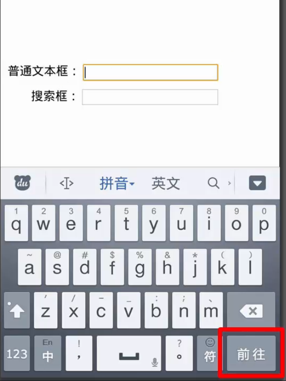

# html5 表单
+ 新增input类型
+ 新增表单元素
+ html5表单验证
+ 新增表单属性


### 新增的input类型
> input原有的type属性值

+ text(普通文本, 默认值)
+ password(密码框)
+ radio(单选按钮)
+ checkbox(多选按钮)
+ file(文件上传组件)
+ button(普通按钮)
+ submit(提交按钮)
+ hidden(隐藏文本域)

> input新增的type属性值

+ search(搜索框)
+ email(邮件输入框)
+ url(url地址输入框)
+ tel(电话号码输入框)
+ number(数字输入框)
+ range(滑动条)
+ date(日期选择)
+ month(月份选择)
+ week(周选择)
+ time(时间选择)
+ datetime-local(日期选择)
+ datetime(包含时区)
+ color(颜色选择)


[示例](示例代码/新增input-type.html)

######  search
```html
<input type="search">
```
它看起来是一个文本输入框,可以输入一个普通的文本  
从语义上,我们可以用它表示一个搜索框,比如说下面这样的:


在移动设备上的额外的特性(安卓手机上的截图)



<!-- 
search在chrome中效果:　
１．在文本框中输入文字，文本框的右侧会出现一个叉，点击这个叉会清除文本框中的内容
２．在移动端，也就是手机浏览器中，当你点击搜索框时，屏幕上会出现一个输入键盘，在键盘的右下角是一个搜索按钮，如果是普通文本框，这个位置是一个前往按钮
如果使用的是其他浏览器，表现可能会有不同
 -->
<!-- 
就目前来，不论是ｐｃ端还是移动端，各种浏览器对我们将要讲到的表单的新特性的实现都不相同，chrome和safari算是对新功能支持的比较完整的，所以，在这部分的演示例子，我们都用chrome
-->

###### email
```html
<input type="email">
```
从语义上讲, 可以输入一个电子邮件

在移动设备上的额外的特性(ipad上的截图)


###### url
可以输入一个url地址

在移动设备上的额外的特性(ipad上的截图)


###### tel
```html
<input type="tel">
```
可以输入一个电话号码

在移动设备上的额外的特性(ipad上的截图)


### 新增表单元素
+ datalist

### datalist
```html
<input type="text" list="browers">
<datalist id="browers">
    <option value="chrome"></option>
    <option value="firfox"></option>
    <option value="ie"></option>
</datalist>
```
<!-- 提供一些输入建议 -->

### 表单验证
表单验证是指,在用户提交表单之前,确保用户输入是数据是合法的

+ 验证输入类型
+ 验证必填字段
+ 验证字符长度
+ 验证数值范围
+ 验证日期和时间范围
+ 步长
+ 正则表达式


[示例](示例代码/表单验证.html)
### 验证输入类型
```html
<form action="success.html" method="post">
    <h2>验证输入类型</h2>
    <label for="">
        数字:
        <input type="number">
    </label>
    <label for="">
        邮箱:
        <input type="email">
    </label>
    <label for="">
        网址:
        <input type="url">
    </label>

    <input type="submit">
</form>
```

###  验证必填字段
```html
<form action="success.html" method="post">
    <h2>验证必填字段</h2>
    <label for="">
        数字:
        <input type="number" required="">
    </label>
    <label for="">
        邮箱:
        <input type="email" required="">
    </label>
    <label for="">
        网址:
        <input type="url" required="">
    </label>

    <input type="submit">
</form>
```

### 验证字符长度
```html
<form action="success.html" method="post">
    <h2>验证字符长度</h2>
    <label for="">
        密码:
        <input type="password" required="" minlength="6" maxlength="10">
    </label>

    <input type="submit">
</form>
```

### 验证数值范围
```html
<form action="success.html" method="post">
    <h2>验证数值范围</h2>
    <label for="">
        订购数量:
        <input type="number" required="" min="6" max="10">
    </label>

    <input type="submit">
</form>
```
### 验证日期和时间范围
```html
<form action="success.html" method="post">
    <h2>验证日期和时间范围</h2>
    <label for="">
        送货日期:
        <input type="date" required="" min="2016-04-01" max="2016-05-01">
    </label>
    <label for="">
        送货时间:
        <input type="time" required="" min="08:00" max="18:00">
    </label>

    <input type="submit">
</form>
```
### 步长
```html
<form action="success.html" method="post">
    <h2>步长</h2>
    <label for="">
        订购数量:
        <input type="number" step="10">
    </label>

    <input type="submit">
</form>
```
###  正则表达式
```html
<form action="success.html" method="post">
    <h2>正则表达式</h2>
    <label for="">
        编号:
        <input type="text" pattern="[0-4]{3}">
    </label>

    <input type="submit">
</form>
```

### 禁用表单验证
html5提供的表单验证还是很简陋, 通常不能达到我们的实际需求, 很多时候我们还是需要使用javascript来完成表单验证, 那么我们就需要禁用html5表单验证,以免产生冲突
```html
<form action="success.html" method="post" novalidate>
```


### 新增的表单属性
+ placeholder
+ autofocus
+ autocomplete
+ multiple

[示例](示例代码/新增表单属性.html)

#### placeholder
```html
<input type="text" placeholder="请输入用户名">
```

### autofocus
```html
<input type="text" autofocus>
```
+ 会在页面加载时自动获取焦点
+ 一个页面只能有一个autofocus属性的定义

### autocomplete
```html
<form action="success.html" method="get" autocomplete="on">
    <h2>autocomplete</h2>
    <label for="">
        用户名:
        <input type="text" name="username" placeholder="请输入用户名">
    </label>
    <input type="submit">

</form>
```

<!-- 提交之后才有效果 , 注意input要加name属性 -->

### multiple
#### 两种用法
> 基本用用

```html
<select name="" id="" multiple>
    <option value="">option1</option>
    <option value="">option2</option>
    <option value="">option3</option>
</select>
```
>type=file

```html
<input type="file" multiple>
```