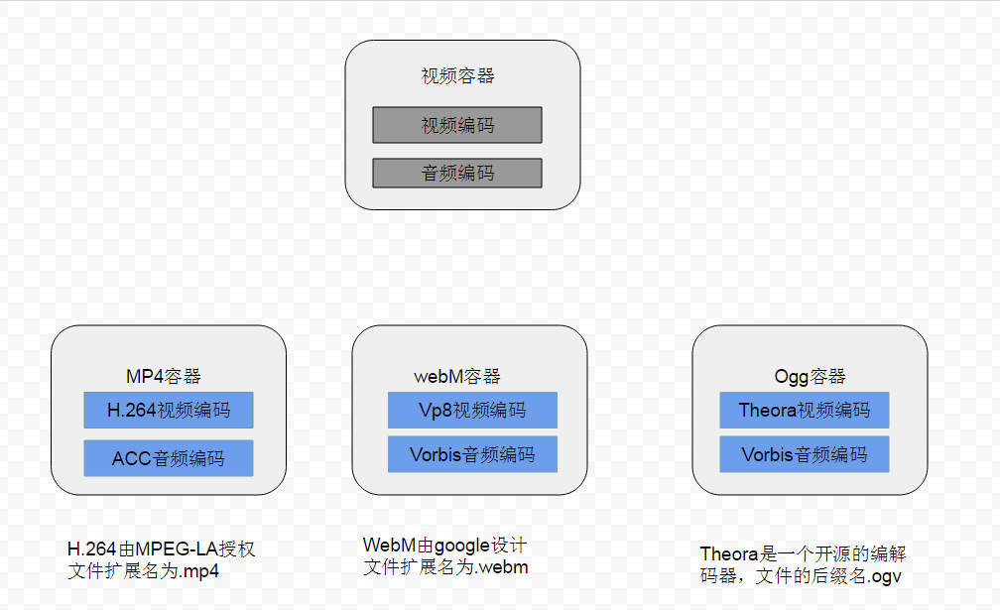

# 视频和音频

在html5中提供了一个video标签。它允许开发者直接将视频嵌入网页，不需要任何第三方插件（比如 Adobe公司的Flash）就能播放。

### video

```html
<video src="xx.mp4" controls></video>
```

### 视频格式
目前 html5支持三种视频格式mp4, webM, ogg


视频格式包含三个部分: 视频容器格式, 视频编码格式, 音频编码格式

平时我笼统的说的视频格式,比如说avi mp4这些实际是指的视频容器的格式

###### 为什么要编码
目的:　缩小视频大小

[HTML5的视频格式之争](http://www.ruanyifeng.com/blog/2010/05/html5_codec_fight.html)


### video 属性
######  autoplay
布尔值， 指定后，视频会马上自动开始播放，不会停下来等着数据载入结束

######  height　width　
指定播放器的的长宽

######  loop
重复播放，如果出现该属性，则当媒介文件完成播放后再次开始播放。 

###### muted
默认静音播放

###### poster
为视频指定海报图像

###### preload
指定预先加载方式，三个可选值
+ none 默认值，不加载任何东西
+ metadata　预先加载元数据
+ auto  预先加载整个视频

### 兼容浏览器
目前，　浏览器对这三种格式的支持并不统一，　所有我们可以这么写

```html
<video controls="">
    <source src="xx.mp4">
    <source src="xx.webm">
    <soucre src="xx.ogv"></soucre>
    <p>对不起, 您的浏览器不支持video标签</p>
</video>
```
浏览器会播放支持的第一个视频格式来播放


上面的写法有个问题：对于每个source元素,浏览器会加载所有视频文件的元数据,查看能不能播放这个视频, 这个工程可能很耗费时间

我们可以指定source的type属性来告诉浏览器该视频的视频格式,浏览器根据这个来判断是否能够播放

```html
<video controls="">
    <source src="xx.mp4" type="video/mp4; codecs='avc1.42E01E, mp41.40.2'">
    <source src="xx.webm" type="video/webm; codecs='vp8, vorbis'">
    <source src="xx.ogv" type="video/ogg; codecs='theora, vorbis'">
    <p>对不起, 您的浏览器不支持video标签</p>
</video>
```

### html4中的视频播放

######  embed标签  （嵌入插件）
```html
<embed src="za.swf" type="application/x-shockwave-flask">
```
<!-- 在html4 我们使用embed标签加载视频插件，这是一段加载flash视频插件和flash视频的代码，这里type属性设置要加载的的插件是flash插件，src属性指定视频的url地址，这里的用法兼容所有的浏览器， 但是embed并不是html标准， html的标准是用object标签，这里很奇葩，标准居然没有不是标准的工作的好-->
######  object标签 

> 基本用法（在低版本ie下无法工作）

```html
<object data="za.swf" type="application/x-shockwave-flask"></object>
```
> 在ie低版本下的用法

```html
<object classid="clsid:d27cdb6e-ae6d-11cf-96b8-444553540000">
    <param name="src" value="zq.swf">
</object>
```
> 兼容性写法

```html
<object classid="clsid:d27cdb6e-ae6d-11cf-96b8-444553540000">
    <param name="src" value="zq.swf">
    <object data="za.swf" type="application/x-shockwave-flask"></object>
</object>
```
