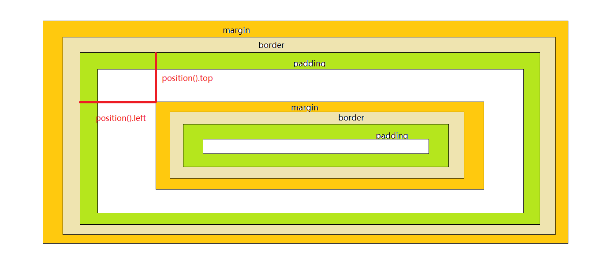
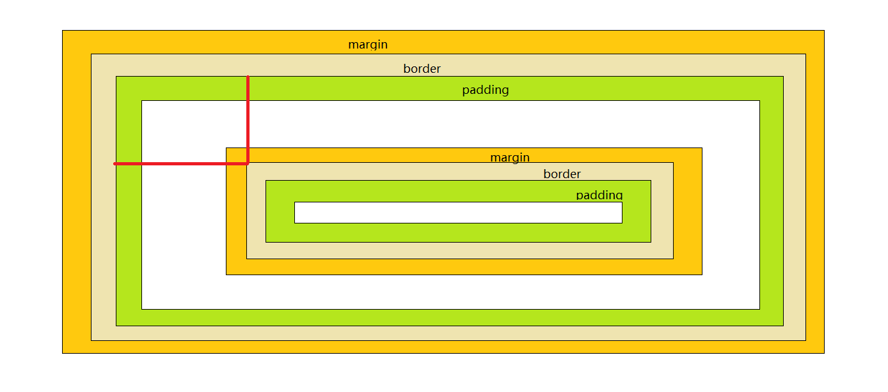

# 元素的尺寸
- width()    height()                    
- innerWidth()  innerHeight()    
- outerWidth()  outerHeight()    
- 参数的作用(设置宽高)
- 与原生JS的区别

```html
<div id="div1" style="width: 100px; padding: 10px; border: 5px solid #111; margin: 20px;"></div>
<script>
$('#div1').width();//width 100
$('#div1').innerWidth();// width + padding  = 120
$('#div1').outerWidth();//width + padding + border = 130
$('#div1').outerWidth(true);//width + padding + border + margin =170
</script>
```

## 参数的作用(设置宽高)

```html
<div id="div1" style="width: 100px; padding: 10px; border: 5px solid #111; margin: 20px;"></div>
<script>
$('#div1').width(200);// width = 200
$('#div1').innerWidth(200);//width: 200 - padding
$('#div1').outerWidth(200);//width: 200 - padding - border
$('#div').outerWidth(200, true);//width: 200 - padding -border - margin
</script>
```

实际都是改变的是width值


## 与原生JS的区别

```html
<div id="div1" style="width: 100px;"></div>
<script>

var oDiv = document.getElementById('div1');
alert(oDiv.offsetWidth);//100
</script>
```

当我们隐藏div之后(display: none)  我们就不能获取到div的值了

```html
<div id="div1" style="display: none;width: 100px;"></div>
<script>

var oDiv = document.getElementById('div1');
alert(oDiv.offsetWidth);//0
alert( $('#div1').width() );//100 jquery是可以获取到隐藏元素的宽高的
</script>
```

## JQ实战小技巧


- 可视区的尺寸(可以理解为窗口的尺寸)
- 页面的尺寸(可以理解为文档的尺寸)

```js
$(window).width();//可视区的尺寸
$(document).width();//页面的尺寸
```

# 滚动距离

+ scrollTop()               
+ scrollLeft()


```js
$(document).click(function(){
    alert( $(document).scrollTop() );
})
```

一个公式 当滚动到底部的时候 滚动距离 + 可视区高度 = 页面的高度
```js
$(document).scrollTop()+$(window).height() === $(document).height();//true
```

# 元素距离

## offset()

元素相对于整个页面的距离

返回一个对象包含left和top属性

```html
<style>
*{ 
    margin:0; 
    padding:0;
}
#div1{ 
    width:200px; 
    height:200px; 
    background:red; 
    margin:200px;
}
#div2{ 
    width:100px; 
    height:100px; 
    background:yellow; 
    margin: 50px;
}
</style>
<div id="div1">
    <div id="div2"></div>
</div>

<script>
alert( $('#div2').offset().top );//250
</script>
```

## position()

相对与最近的父级定位元素的距离


注意:  position() 是计算的margin的顶点到父级定位元素的距离, 其他跟位置相关的函数或属性都是以border的顶点为参考点




```html
<style>
*{ 
    margin:0; 
    padding:0;
}
#div1{  
    margin: 30px;
    border: 20px solid #111;
    padding: 10px;
    background:red;
    position: relative;

   
}
#div2{ 
    width:100px; 
    height:100px;
    margin: 30px;
    border: 20px solid #111;
    padding: 10px; 
    background:yellow;
}
</style>
<div id="div1">
    <div id="div2"></div>
</div>

<script>
alert( $('#div2').position().left );//10 
alert( $('#div2').offset().left );//90
alert($('#div2').get(0).offsetLeft);//40
</script>
```


```html
<style>
*{ 
    margin:0; 
    padding:0;
}
#div1{  
    margin: 30px;
    border: 20px solid #111;
    background:red;
    position: relative;

   
}
#div2{ 
    width:100px; 
    height:100px;
    margin: 30px;
    background:yellow;
}
</style>
<div id="div1">
    <div id="div2"></div>
</div>

<script>
alert( $('#div2').position().left );//0 
</script>
```


<!-- 实战小技巧

利用计算原理，得到相应值
```js
$('#div2').offset().left - $('#div2').offsetParent().offset().left
```  -->

- 例子   :  懒加载页面中的图片

```html
<style>
div{ 
    margin-top:300px; 
    width:470px; 
    height:150px; 
    border:1px #000 solid;
}
</style>
<div></div>
<div></div>
<div></div>
<div></div>
<div></div>
<script>
toChange();//页面第一屏
$(window).scroll(toChange);
function toChange(){
        
    $('img').each(function(i,elem){
        
        if( $(elem).offset().top < $(window).height() + $(window).scrollTop() ){
            
            $(elem).attr('src',$(elem).attr('_src'));
            
        }
        
    });
    
}
</script>
```

# JQ的事件

+ on()                         
+ off()                         
    + JQ中都是绑定的形式
    + 支持多事件写法
    + click()写法，也是采用off()取消


JQ中的事件绑定可以使用相应的事件函数比如说

click() mouseover() mousermove()..

也可以使用on()方法

```js
$('div').on('click', function(){
    alert(1);
})
```

其实click()等函数内部也是调用的是on()方法


支持多事件写法:

```js
$('#div1').on('click mouseover',function(){
    alert(123);
});
```

通过on方法添加的事件, 可以通过off方法移除


```js
function fn1(){
    alert(1)
}
function fn2(){
    alert(2)
}

$('#div1').on('click',fn1);
$('#div1').on('click',fn2);

$('#div1').off('click',fn1);//移除click事件的某一个函数
```

```js
function fn1(){
    alert(1)
}
function fn2(){
    alert(2)
}

$('#div1').on('click',fn1);
$('#div1').on('click',fn2);

$('#div1').off('click');//移除click事件的所有函数
```

```js
function fn1(){
    alert(1)
}
function fn2(){
    alert(2)
}

$('#div1').on('click mouseover',fn1);
$('#div1').on('click mouseover',fn2);


$('#div1').off();//删除所有的事件操作
```

click()写法，也是采用off()取消

```js
function fn1(){
    alert(1)
}

$('#div1').click(fn1);
$('#div1').off('click', fn1);
```


# 事件主动触发

+ trigger()             
    + 比 click()形式更强大
+ 事件的命名空间
+ 例子  :   主动触发的添加内容


什么叫主动触发, 比如说我们给一div绑定一个点击事件, 我点击该div会触发

我们也可以通过程序, 不用点击div来触发, 这就是主动触发

```js
$('#div1').click(function(){
    alert(123);
});

$('#div1').trigger('click');
```


## 事件的命名空间


```js
$('#div1').on('click',function(){
    alert(1);
});

$('#div1').on('click', function(){
    alert(2)
});

$('#div1').trigger('click');
```

1和2都会被弹出, 如果我们只想弹1 , 我们可以使用事件的命名空间

```js
$('#div1').on('click.abc',function(){
    alert(1);
});

$('#div1').on('click', function(){
    alert(2)
});

//$('#div1').trigger('click');1和2还是会弹出

$('#div1').trigger('click.abc');//只弹1
```


事件命名空间类似css的类，我们在事件类型的后面通过点加名称的方式来给事件添加命名空间

jquery现在的事件API：on，off，trigger支持带命名空间的事件


`click.a.b` 命名空间的名称分别是.a和.b，而不是a和a.b 注意命名空间的名称前面一定要带点，这个名称在off的时候可以用到


例子  :   主动触发的添加内容

我们可以点击添加按钮和按回车来添加内容

```html
<input id="input1" type="button" value="添加"><input id="input2" type="text">
<ul>
    <li>1111</li>
    <li>1111</li>
    <li>1111</li>
    <li>1111</li>
</ul>
<script>
$('ul').delegate('li','click',function(ev){
        $(this).css('background','red');
    });
    
$('#input1').click(function(){
    var $li = $('<li>'+ $('#input2').val() +'</li>');
    $('ul').append( $li );
});

$('#input2').keydown(function(ev){
    if( ev.which == 13 ){
        //用函数也可以, 但这里主动触发要简单一些
        $('#input1').trigger('click');
        
    }
});
</script>
```

例子:　拖拽

```html
<div id="div1">div</div>
<script>
var disX = 0;
var disY = 0;
var $div = $('#div1');

$div.on('mousedown',function(ev){
    
    disX = ev.pageX - $(this).offset().left;
    disY = ev.pageY - $(this).offset().top;
    
    $(document).on('mousemove.drag',function(ev){
        
        $div.css('left',ev.pageX - disX);
        $div.css('top',ev.pageY - disY);
        
    });
    
    $(document).on('mouseup.drag',function(){
        
        $(this).off('.drag');//加了命名空间，　不会误取消，其他加在document上的事件
        
    });
    
    return false;
    
});
</script>
```


# 工具方法

我们之前见到的方法：

$().css();   $().html();   $().click();　都需要获取元素　　都是针对JQ对象的

像下面这种形式的：

$.xxx()  $.yyy() $.ccc()

我们称为工具方法，　可以直接调用的


+ $.type()                         
    + 比原生typeof更强大
+ $.isFunction()                
+ $.isNumeric()               
+ $.isArray()                    
+ $.isWindow()                
+ $.isEmptyObject()        
+ $.isPlainObject() 


## $.type()

```js
$.type('abc');//"string"
```

用来获取JavaScript数据类型

使用typeof可以判断基础类型，　不能判断复合类型

```js
typeof 'aa';//"string"
typeof 11;//"number"
typeof false;//"boolean"
typeof function(){};//"function"
typeof {};//"object"
typeof [];//"object"
typeof new Date();//"object"
```

```js
console.log( $.type('aa') )//"string"
console.log( $.type(11) )//"number"
console.log( $.type(false) )//"boolean"
console.log( $.type(function(){}) )//"function"
console.log( $.type({}) )//"object"
console.log( $.type([]) )//"array"
console.log( $.type(new Date()) );//"date"
```

## $.isEmptyObject()

判断是否为空对象, 也可以判断数组

```js
alert($.isEmptyObject({}) )//true
alert($.isEmptyObject({name: 11}) )//false
alert($.isEmptyObject([]) );//true
```

## $.isPlainObject() 

测试对象是否是纯粹的对象（通过 "{}" 或者 "new Object" 创建的）


>我们知道，　这种形式`{}`数据类型的我们成为对象，也叫做对象字面量，也叫做json对象
数组，　函数，new Date() 等等通过构造函数生成的我们也称为对象


```js
var obj1 = {};
var obj2 = {name: 1};
var obj3 = [];
var obj4 = new Date();

alert( $.isPlainObject(obj1) );//true
alert( $.isPlainObject(obj2) );//true
alert( $.isPlainObject(obj3) );//false
alert( $.isPlainObject(obj4) );//false
```


# 工具方法
+ $.extend()     
    + 深拷贝操作


# $.extend()


```js
var o1 = {name: 'hello'};
var o2 = o1;
o2.name = 'Hi';
alert(o1.name);//Hi
```

改变o2会影响到o1


如果想改变o2不影响o1, 我们需要拷贝，　使用for in 可以实现

```js
var o1 = {name: 'hello'};
for(var key in o1){
    o2[key] = o1[key];
}
o2.name = 'Hi';
alert(o1.name);//hello
```

使用$.extend也可以办到

它的作用是将第二个对象中的属性复制到第一个对象中

```js
var o1 = {name: 'hello'};
var o2 = {};
$.extend(o2, o1);
o2.name = 'Hi';
alert(o1.name);//hello
```

上面的操作我们称为对象的浅拷贝

下面来讲什么是深拷贝

```js
//如果对象属性的值不是简单的数据类型，　而是一个对象
var o1 = {
    name: {
        first: 'hello'
    }
}

var o2 = {};
$.extend(o2, o1);
o2.name.first = 'Hi';
alert(o1.name.first);//Hi
```
如果对象属性的值不是简单的数据类型，　而是一个对象，我们依然会改变到o1

这是浅拷贝，　深拷贝是将所有为对象的都拷贝一次，在$.extend()函数中，　我们只需要将第一个函数设为true就为深拷贝


```js
var o1 = {
    name: {
        first: 'hello'
    }
}

var o2 = {};
$.extend(true, o2, o1);
o2.name.first = 'Hi';
alert(o1.name.first);//hello
```

$.extend也将多个对象的内容合并到第一个对象。

```js
var o1 = {};
var o2 = {name: 1};
var o3 = {age: 2};

$.extend(o1, o2, o3);
o1;//{name: 1, age:2}

```

后写的对象中的属性会覆盖前面的对象中的属性

```js
var o1 = {};
var o2 = {name: 1};
var o3 = {name: 2};

$.extend(o1, o2, o3);
o1;//{name: 2}
```


