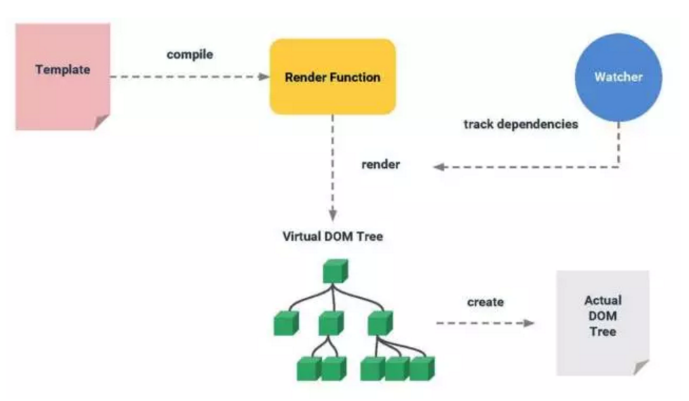
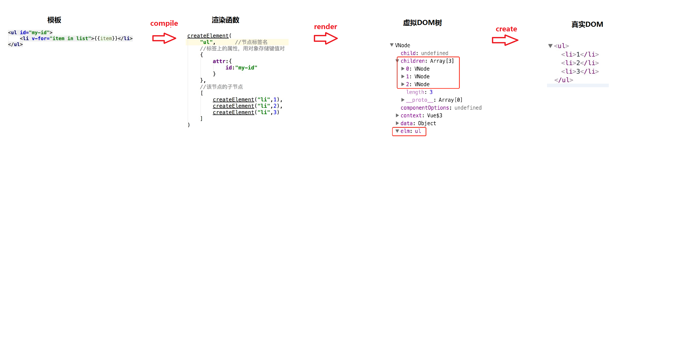
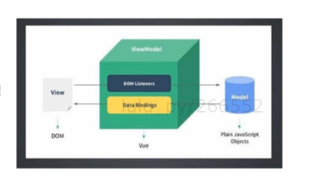

# vue介绍

## 第一个vue程序


[demo01](code/demo01.html)

```html
<div id="demo01">
    {{text}}
</div>
<script src="./lib/vue.js"></script>
<script>
var vm = new Vue({
    el: '#demo01',
    data: { text: 'hello world!' }
})
</script>
```

## vue中的两个核心点

### 响应的数据绑定


[demo02](code/demo02.html)

```js
var vm = new Vue({
    el: '#demo01',
    data: { text: 'hello world!' }
})

vm.text = 'change';
```


当数据发生改变 --> 自动更新视图
利用`Object.defineProperty`中的setter/getter代理数据, 监控对数据的操作
它的实现是依赖`Object.defineProperty`, 所以vue.js不支持ie8

### 组合的视图组建

- ui界面映射成组件树
- 划分组件可维护，可重用， 可测试


[饿了么组件库](http://element.eleme.io/#/zh-CN/component/installation)


## 虚拟DOM

js运行速度很快， 操作dom速度很慢， 利用在内存中生成与真实dom对应的数据结构

当数据发生变化时， 能够智能计算出重新渲染界面的最小代价并应用到dom操作上




## MVVM模式

M: model 数据模型
V: view 视图模板
vm: view-model视图模型



改变model可以影响view

view监听事件可以改变model, model的改变反过来又影响到了view

v层和m层通过vm层联系到一起

例子：

[双向数据绑定](./code/demo03.html)

```html
<div id="demo03">
    <input type="text" v-model="text">
    <p>{{text}}</p>
</div>
<script src="./lib/vue.js"></script>
<script>

//vm实例
var vm = new Vue({
    el: '#demo03',
    data: { text: 'hello world!' }
})
</script>
```

## vue实例


### 绑定事件

[demo04](code/demo04.html)

```js
<div id="demo04">
    <span v-on:click="clickHandler">click</span>
</div>
<script src="./lib/vue.js"></script>
<script>


var vm = new Vue({
    el: '#demo04',
    methods: {
        clickHandler: function(){
            alert(1);
        }
    }
})

</script>
```

## 指令

指令（Directives）是带有 v- 前缀的特殊属性。指令属性的值预期是单一 JavaScript 表达式

几个内置指令：

`v-bind` 简写 :

[demo05](code/demo05.html)

```html
<div id="demo05">
    <!-- 冒号后面是参数 -->
    <span v-bind:customId="id">click</span>
</div>
<script src="./lib/vue.js"></script>
<script>

var data = {id: 1};

var vm = new Vue({
    el: '#demo05',
    data: data,
    methods: {
        clickHandler: function(){
            alert(1);
        }
    }
})
</script>
```

`v-on` 简写 @

## 模板

### html模板

html DOM 模板

#### 插值

- 文本插值 （双大括号）

```html
<div >{{text}}</div>
```

- 原生的html `v-html`

双大括号输出的是文本, 不会解析html, 使用`v-html`指令就可以解析html

[demo06](code/demo06.html)

```html
<div id="demo06">
    <span>{{text}}</span>
    <span v-html="text"></span>
</div>
<script src="./lib/vue.js"></script>
<script>

var data = {
    text: '<div>hello world!</div>'
}

var vm = new Vue({
    el: '#demo06',
    data: data
})
</script>
```

- 绑定属性  `v-bind`

可以写简单表达式，比如 '1+1', 三目'true? 1: 2', 不要写if等


### 字符串模板

模板为字符串， 通过tempalte属性传给vue

[demo04](code/demo04.html)

```js
<div id="demo07">
</div>
<script src="./lib/vue.js"></script>
<script>

var data = {
    text: 'hello world!'
}
var tpl = '<span>{{text}}</span>'
var vm = new Vue({
    el: '#demo07',
    data: data,
    template: tpl
})

</script>
```

注意:  这种方式会把挂载元素替换掉，所以 `<div id="demo07">`不会存在， 只能有一个根节点

还可以放在script标签里， 注意type

```html
<div id="demo08">
</div>
<script src="./lib/vue.js"></script>
<script type="x-template" id="tpl">
    <span>{{text}}</span>
</script>
<script>

var data = {
    text: 'hello world!'
}
var vm = new Vue({
    el: '#demo08',
    data: data,
    template: '#tpl'
})

</script>
```

### 模板render函数

使用render函数来生成虚拟dom

createElement(标签， 数据对象， 子元素)

- 标签 : string | object | function
- 数据对象: 一个包含模板相关属性的数据对象
- 子元素: 子节点(VNodes)，可以是一个字符串或者一个数组. 可选参数

```html
<div id="demo09">
</div>
<script src="./lib/vue.js"></script>
<script>

var data = {
    text: 'hello world!'
}
var vm = new Vue({
    el: '#demo09',
    data: data,
    render: function(createElement){
        return createElement('ul',
            [
                createElement('li', 1),
                createElement('li', 2)
            ]

        );
    }
})

</script>
```

#### 数据对象

```js
{
  // 和`v-bind:class`一样的 API
  'class': {
    foo: true,
    bar: false
  },
  // 和`v-bind:style`一样的 API
  style: {
    color: 'red',
    fontSize: '14px'
  },
  // 正常的 HTML 特性
  attrs: {
    id: 'foo'
  },
  // 组件 props
  props: {
    myProp: 'bar'
  },
  // DOM 属性
  domProps: {
    innerHTML: 'baz'
  },
  // 事件监听器基于 "on"
  // 所以不再支持如 v-on:keyup.enter 修饰器
  // 需要手动匹配 keyCode。
  on: {
    click: this.clickHandler
  },
  // 仅对于组件，用于监听原生事件，而不是组件内部使用 vm.$emit 触发的事件。
  nativeOn: {
    click: this.nativeClickHandler
  },
  // 自定义指令. 注意事项：不能对绑定的旧值设值
  // Vue 会为您持续追踪
  directives: [
    {
      name: 'my-custom-directive',
      value: '2'
      expression: '1 + 1',
      arg: 'foo',
      modifiers: {
        bar: true
      }
    }
  ],
  // Scoped slots in the form of
  // { name: props => VNode | Array<VNode> }
  scopedSlots: {
    default: props => h('span', props.text)
  },
  // 如果组件是其他组件的子组件，需为slot指定名称
  slot: 'name-of-slot'
  // 其他特殊顶层属性
  key: 'myKey',
  ref: 'myRef'
}
```


